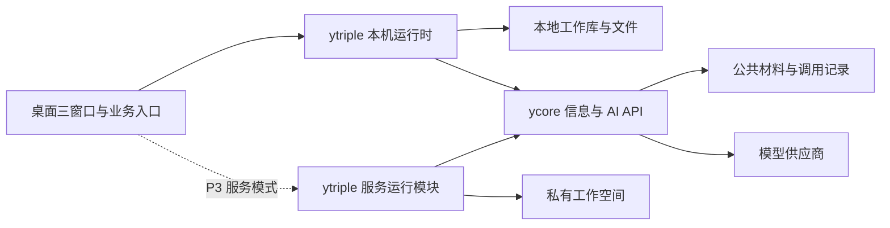

# ytriple 架构方向

本文维护当前技术结构、领域约束与实现边界。产品目标见 [PRODUCT.md](PRODUCT.md)，本轮范围与交付状态见 [PLAN.md](PLAN.md)。未接通能力在相应章节明确标注，不能以架构存在推断已经交付。

## 1. 产品运行时与公共服务分开

ytriple 掌握目标、团队、私人上下文、过程和成果；ycore 掌握公共信息协议与共享模型能力。模型在服务器生成文本不等于整个团队已经在服务器执行。P0–P2 的本机团队调用远端 AI；P3 才交付 PRODUCT 所描述的完整服务模式。

两者之间只用版本化 API，不跨仓库 import 内部实现、不访问对方业务表。工作 ID 与 ycore 调用 ID 分开；一次成员任务可以有多个模型调用，一次工作可以有多轮运行。

## 2. 桌面起点

默认采用 Electron + React + TypeScript，领域与服务适配运行在本机 Node 环境，UI 通过有限、类型化命令访问。选择依据是直接复用 ycore 的 Node 消费契约、文件能力和后续同语言服务运行模块，减少首轮接线；不沿用已清空的旧代码为完成基线。

本机领域运行时不依赖 React 或 Electron API；文件、凭据、模型、存储与运行事件通过少量实际需要的边界接入。P3 可复用领域代码，不要求 P0 就造通用插件框架或实现所有远程接口。重型处理与长任务不能阻塞桌面交互。

默认 SQLite 保存工作关系、事务状态、检索和版本索引，用户成果/导出采用可读取文件。内部结构化状态为工作记录依据，导出不是第二个竞争的工作库；项目正式文件继续以项目原路径为准。由运行时统一处理成果版本和外部修改冲突。具体 SQLite 绑定须先验证 Electron 打包兼容性，不依赖当前残留 node_modules。

renderer 不取得服务密钥、原始文件系统或任意命令执行能力。网络材料按不可信内容显示；HTML 清洗、外链打开和本地动作分别处理。服务令牌与自带 API 凭据使用系统安全存储，备份不携带秘密。

## 3. 从首轮建立连续的对象关系

| 对象 | 核心职责 |
| --- | --- |
| 工作 | 目标、有效约束、归属、获准材料；可独立存在再归入项目 |
| 运行 | 本轮目标版本、输入范围、执行位置、真实状态与模型调用关联 |
| 成员任务 | 负责人、委派关系、使用的角色/Skill 版本、输入与返回；保留当时身份 |
| 公开过程 | 实际收到的分析、证据、工具动作、问答、异议和修正，关联原任务与发生顺序 |
| 材料引用 | 本地身份、来源、覆盖范围；远端材料额外保留服务身份、文档 ID 与准确修订 |
| 成果及版本 | 同一成果的正文、修订父版本、依据、AI 修订与并发冲突；交接/使用/验证指向具体版本 |
| 决定与反馈 | 内容、依据、生效范围、是否采纳和后续使用证据，不自动变为全局规则 |

项目、作品、雷达议题和定时委托围绕这些对象组织入口。首页、通知、查找和三窗口引用同一对象，不分别保存竞争的工作状态。ID 与时间从起点独立于本地路径、窗口、成员名和供应商，便于后来接入服务工作空间。

### 3.1 对象约束与命令边界

交互依据为 [INTERACTION.md](INTERACTION.md)。工作只有一个可空 projectId 和一个可空 deliveryId；交付存在时必须属于该项目。雷达、材料和资产使用多对多版本引用，不能用一个可变 owner 字段混装项目和来源。交付的 adoptedArtifactVersionId 与成果的最新草稿分开；采用是明确命令，新版本写入不更新采用指针。

资产是带用途的引用/版本索引，不复制成果正文。原工作更新后资产可提示有新版，既有使用继续指向原版本；正式项目文件与导出副本不冒充自动同步。项目标准只有明确采纳后才影响后续工作，运行保存使用的标准版本。

待决包含工作、目标/成果基准版本、问题、必要性、选项、影响范围和状态。答复写入决定并恢复原等待运行须保证一次提交；已过时或重复答复不应用到新目标。首页按原对象查询投影，不创建独立待办表替代领域状态。一般证据缺口不产生待决。

界面草稿保存入口、工作/新工作意图、引用和返回位置。导航命令不触发执行；首次发送以提交身份原子建立工作、消息和运行关联，重复提交返回已有记录。运行中补充由用户明确提交后保存为下一轮输入，绑定原工作、精确引用版本及提交身份；草稿和已排队消息分开。仅当原轮成功且无待决/停止/失败时串行接续；停止同时暂停待发，异常保留补充由用户明确继续。回答待决绑定决策 ID 与版本，通过原恢复点继续，不能当作通用补充。完整输入状态见 [底部输入契约](INTERACTION.md#底部输入契约)。同一成果的提交串行化或校验基准版本，定时/主动运行及并发生成都不能后写覆盖；当前成果修改只通过 AI 生成新版本，不提供直接文件编辑接口。

定时委托绑定稳定工作 ID，触发具有独立发生身份并追加运行。工作、运行和交付状态分开，不从模型终态推导项目完成。团队配置、流程和布局仍维持第 4 节的独立边界，不因交互收敛而写死角色或升级策略。

## 4. 团队执行与三窗口

### 4.1 分开布局、团队搭配、流程与执行

| 独立部分 | 管理内容 | 与其他部分的边界 |
| --- | --- | --- |
| 布局 | 决策/过程/结果的区域、顺序、比例、页签、聚焦与设备偏好 | 只呈现和导航，不创建成员或推进流程；默认左决策、右过程/结果切换，也可三面自由排列 |
| 团队搭配 | 成员身份、责任、角色绑定、可用 Skill/工具和模型能力需求 | 不固定窗口数量或执行顺序；通过角色绑定供流程使用，不硬编码某位成员姓名 |
| 协作流程 | 分工、调查、核查、汇合、用户介入与结束条件 | 不绑定具体 UI、供应商或固定人数；在既有运行边界内独立发布版本 |
| 执行内核 | 版本化 agent 内核：策略、有界循环与提示/工具反馈政策；经窄宿主端口调用模型与工具 | 新运行冻结 execution 与检查点；无清单旧记录走 legacy |

八个 agency-agents 模板固定 commit、源文哈希和 MIT 许可，复制成可编辑成员，默认无工具/技能。职责与出处随团队、运行、备份冻结。

布局、搭配、流程与内核同仓独立演进，不建通用流程设计器。每轮冻结成员/能力、流程和执行协议快照；缺失或不兼容即阻塞。升级只影响新提交，变更旧工作须在可恢复边界显式接续，不能静默解释旧记录。无清单旧运行保留 legacy，待其全部结束后才可移除执行器，历史始终可读。切布局不增加调用、不改变任务或成果身份，重开恢复布局与快照。

自建轻量 harness：`agent-executor` 选阶段，`agent-loop` 统一普通步骤与子任务的提示、模型、顶层控制、工具反馈和停止；正文 JSON 不执行。`AgentKernel` 独立提供阶段计划、委派许可、提示/上下文组装与失败政策。`AgentHost` 窄端口连接模型、材料、记录和工具；权限、限额、持久化、调用身份、队列与成果校验仍归宿主。桌面与私有服务复用 Runtime。

升级须注册新内核版本，通过 Runtime 的 `KernelReference` 选择新提交；旧版本禁止覆写。流程选择固定步骤或按需委派，内核版本由可信宿主选择。恢复校验 `execution`/检查点和协议，再用贡献、回执、待决重建循环；不兼容即阻塞，未知调用先核对。测试验证 v1/v2 实际调用差异、旧轮跨版本接续、计划/提示替换与备份往返；默认仍是 v1。

### 4.2 执行与过程表达

采用有界编排：负责人确定需解决的问题，按实际需要委派和核查，合并有效贡献。不同成员要接收并使用彼此的成果；并发多少、采用何种框架以可观测性、取消、持久化和恢复的实际实现成本决定，不先打造通用 Agent 平台。

每轮限制模型调用数、输入量、时间与可用工具。普通阅读/保存材料不启动模型。付费调用先持久化关联与幂等键，终态成功才提交完整结果；部分内容可保存为草稿，失败不能伪装成功。

过程窗分开呈现宿主执行记录与 AI 公开依据摘要，不索取内部推理。`team-response-v1` 兼容旧响应，可附 `public` v1；非法附属数据只警告，不放宽 answer/artifact 校验，不追加修补调用。决策面只显示回答和待决。

用户改变目标或成果基准版本时，后续提交校验该基准；迟到结果进入可追溯的旧轮记录，不覆盖当前成果。停止先阻止新增委派，再取消能取消的调用，保留已完成贡献；未确认远端停止时明确显示未知/待核对。

## 5. ycore v0.1.0 消费要求

协议依据为 ycore 的 `docs/INTEGRATION.md`、`packages/contracts/openapi.json` 与 `examples/ytriple-client.ts`。在客户端生成/维护边界类型并记录协议版本，不把 ycore 整个仓库作为运行依赖。

- 快照读完并落盘后保存同步游标；增量材料更新与游标推进同一事务提交。游标过期重新同步，保留已被成果引用的旧修订。缓存命名空间包含所选服务与调用主体，不跨服务/身份复用游标或私有调用结果。
- 原始发布时间未知就保留未知；`coverage`、`format` 与 `full_article=false` 如实展示。产品主题理解与上游配置 topics 分开。
- 每次模型调用用独立幂等键，保存到产品运行/成员任务的映射；响应不明先找回已有调用，不自动生成新付费请求。
- SSE 只有 `run.completed` 证明成功，EOF 不证明完成；JSON 用持久任务状态查询。当前 JSON 无取消 API，停止派生团队任务不宣称已撤销已提交的 JSON 调用。
- 当前接口提供 stream/json，不提供原生工具调用。成员可以返回经校验的行动建议，由 ytriple 在获准工具和范围内执行；模型文本与返回内容不能自行授予权限。
- 当前输出上限为每次 4096 tokens，材料引用最多 20 个；复杂成果按章节或子任务组织并保存版本，不能以单次截断文本冒充完整长文。其余约束以实际契约为准。
- AI 不可用时公共材料与本地资产仍可读；信息源受阻不阻止用户以已有资料开展工作。费用未知显示未知。

## 6. 本机与服务空间

本地模式默认本地持久化；每次远端模型调用仅发送当前授权范围内所需内容，并说明它会由所选 AI 服务处理。索引、浏览、选择、总结标题均不等于上传全部正文的授权。

P3 增加服务模式：ytriple 自己维护团队执行及私有工作 API，可以与 ycore 共用现有主机和托管数据库设施，但须分开 schema/权限、迁移、资源预算和发布责任。共享主机不代表产品数据成为公共数据；不提前增加数据库、队列或服务器实例。

共享登录与服务权益由 ycore 对接托管能力，产品模块仍须做工作空间对象授权。AI 服务不会替产品证明“此用户可读此项目”。两类空间显式区分；首次远端接续前落实导入/导出、设备草稿、提交幂等、版本冲突和删除范围，不自动双向同步整个文件系统。

通用来源调度属于 ycore；用户的“每周复盘此项目”属于 ytriple。产品服务调度复用成熟持久任务组件，每个委托只有一个执行责任方。服务端拿不到本地文件时不能虚构检查或结果。

## 7. 文档与实现的使用方式

PRODUCT 决定产品行为，PLAN 由 Codex 内部维护开发顺序，本文件说明当前架构选择。[DESIGN.md](DESIGN.md) 记录工作面布局与操作边界。按真实可操作界面验证布局，不把 Git 历史布局当成已批准的新界面规格。跨 ytriple/ycore 的必要改动统一协调，对用户报告结果与实际阻塞，不要求逐阶段批准工程拆分。

运行版本、安装与部署证据仅在 PLAN 维护；技术结构不记录每轮测试数和发布流水。未验证项保持未验证。

### 待决执行检查点（当前桌面实现）

成员可返回严格校验的完整 `ytriple_decision` 控制对象；普通文字、引用中的示例和一般证据限制不自动变成待决。待决与运行/成员步骤/成果基准版本关联，暂停该工作及后续队列。缺字段或不完整控制输出不能作为成果发布，原输出保留供排查。

答复事务检查问题版本、草稿版本、原服务和成果基准；提交身份保证重复请求只接受一次。恢复使用同一运行、同一步骤的新尝试标识，前序贡献复用；该尝试的服务幂等键独立持久化，丢失首事件仍能只读找回原付费调用。退出或重开不自动提交答案；已提交但未执行的恢复请求重开后由用户明确继续。此为产品运行时行为，ycore 继续只承担通用模型调用，不存放 ytriple 的待决对象。

## 本地根目录与项目要求

工作空间配置两个独立的已有根目录：Code 承载本地项目，AI 承载工作流、知识与可复用成果等资产。首次启动发现用户主目录下的 AI/Code；之后以已保存配置为准，通过原生文件夹选择器更换。路径不写死用户名，不创建第二套目录。更换根目录不搬迁旧文件或修改已有项目身份；旧项目目录超出新 Code 范围时需重新关联。

项目可关联 Code 内具体目录，保存规范化真实路径；重复关联同一目录复用同一项目。目录关联不等于读取源码、理解项目或授权执行。Code 发现仅有界检查目录及 Git 标记，最多 300 个目录、深度 3；无 Git 标记或更深项目仍可手动关联。AI 目前读取既有 system/resources.json 与 system/knowledge.json 的登记项；不把索引内命令、URL 或权限声明当成执行指令。资产读取、导出和方法使用需各自的明确操作，见下文资产与 Skill 边界；不把 SQLite 工作状态自动迁往 AI。

所有打开和关联操作在主进程校验真实路径及根目录包含关系；符号链接逃逸不可打开，丢失路径保留关联并报告不可用。Renderer 只发类型化命令，不获得通用文件访问接口。

项目目标和参考材料按 brief 修订保留，项目标准按独立标准身份与修订保留，可限定到一个交付。标准可由准确成果版本或选段明确采纳；此操作不编辑成果正文、不改变交付采用关系。每次显式发送冻结当时项目目标、有效标准和准确材料版本；队列中的旧运行不随之后修改漂移。跨项目移动工作只影响未来发送。项目要求对话框的未保存表单尚无持久草稿；项目文件快照、固定建议与初始化的具体实现边界见下文章节，不将有限文件读取称作完整项目理解。

## 资产的本地文件与复用

“加入资产”保存准确材料身份、版本与可选范围，不复制为另一份正式项目正文。资产页可查找、预览保存范围、发起带此引用的新工作草稿；同一资产的未发送草稿复用原上下文，保留文字、其他引用与交流对象。浏览、加入、导出、恢复均不创建模型运行，项目标准仍需独立明确采纳。

可复用资产通过原生保存对话框写入已配置 AI 根目录中的用户选择位置；默认优先已有 knowledge 目录，不新建目录体系，不写 system/cache。文件是 Markdown 正文与头部编码来源记录，来源包括原材料版本、覆盖范围、选段标记以及可用的工作/项目名称。仅导出选段时不携带未选择的全文。独占创建拒绝覆盖同名文件或符号链接；应用记录保存时的文件校验值，主动检查可区分一致、变化、丢失与不可访问。外部变化不改写保存快照。

恢复最多 1 MB 的 ytriple 资产 Markdown；验证格式和正文校验值，在事务中建立新的本地材料身份，外部来源 ID 不复用为本地工作或规则身份。相同包幂等恢复，同名不同内容并存，来源元数据是文件携带的声明，不是身份认证或内容真实性证明。修改后的普通文件可按新材料导入，但不能冒充未经修改的原资产。恢复不执行文件内指令，不应用项目标准，不恢复模型密钥。

这一格式携带单项资产快照及基本来源，不是全工作空间备份，也不包含整条过程、来源全文、工具执行记录或团队运行环境。完整工作空间关系由下文独立备份格式承载；单项资产文件仍不承担整空间恢复。

## 输出用途与公开过程快照

Draft/Run 保存可选 outputMode，旧数据默认为 result；explanation 只产生交流回答，summary/review 生成各自独立的 ArtifactVersion.kind 与 artifactId 版本链。运行基准、并发候选、待决的版本校验、后续 AI 修订按对应类别取版本；主成果的交付采用不接受支持类别。此前只有一种成果的记录不用迁移，历史引用不变。

ProcessRecords 按工作、轮次或所选记录冻结公开贡献、材料、决定与准确成果，24 KB 超限明确拒绝。原始记录可直接导出 Markdown；复盘、文档和方法先准备草稿，用户发送后生成独立版本链。

过程任务限定所选快照。普通交流按 `workSeq` 与轮次/字节预算接续，较早用户输入进入背景区，explanation 附有界主成果。`team-response-v1` 分开答复与可选 artifact，修订校验 `baseVersionId`。首次执行冻结 `contextSnapshot`，恢复复用；非法终态不发布，旧协议保持兼容。控制轮不施加最终 JSON Schema，终态由宿主校验；托管请求兼容旧版 ycore。

### 项目文件快照与理解

`ProjectFiles` 将目录检查、正文捕获、草稿准备分开。检查保存在 `project-inspection`；正文进入带 `projectSource`（项目、根、相对路径、SHA-256、大小、修改时间、类别）的版本化材料。材料身份绑定项目和真实根路径；更换关联目录不会让旧快照获得新目录的引用资格。读取使用普通文件校验、父目录真实路径核对和不跟随符号链接的打开方式，并在读取后检查文件及项目绑定是否变化；一批全部读取成功才原子保存。

`project-reading-work` 为项目保留理解工作的身份，后续批次回到原工作，草稿及其他引用保留，明确发送才能运行。运行提示中的材料标题包含准确版本；已有快照不等于模型已处理，UI 单独列出成功运行使用的准确版本与选段。现有理解仅依据其运行引用判定需要复核，不宣称没有引用的文件已被理解。目录、文件及核对字节均有显式上限；全面覆盖大型项目仍待实现。

### 固定项目建议文档

`ProjectSuggestions` 以 `suggestion-document` 保存项目/根目录/固定路径绑定，以 `suggestion-preview` 保存服务端生成的准确成果范围、旧文档哈希和追加文本。渲染进程写入时只提交预览身份，不能提交任意替换正文；主进程复核当前绑定、成果所属项目和真实文件边界，再通过 append 方式保留已有内容。首次创建使用 exclusive create，不隐式覆盖已有文件。建议位置由用户选择，不从文档指令取得写入授权。

每条追加包含由项目、成果版本与选段确定的身份。重试先查完整原条目；单独标记不足以宣告成功。收据保存在 `suggestion-receipt`，不修改成果版本、交付或项目标准。成功写入前后的权限及正文校验可发现变化，但文件系统与 SQLite 不是统一事务，也不对外部编辑器提供锁定保证。处理外部冲突时保留文件现状并要求重新预览，不自动覆盖或重放模型调用。

### 项目初始化记录

`ProjectInitialization` 保存不可变来源内容和预览计划，渲染进程执行时只提交计划 ID。`initialization` 记录项目身份、模板、规则与来源摘要、目标目录、生成文件、状态/步骤/错误和提交；Snapshot 只投影摘要。`initialization-form` 保存未执行的输入，不启动 Git 或写入目标项目。

现有 local-ai-control-plane v1 适配器读取配置的 AI/Code 根目录和静态系列登记，不执行 manifest 中的命令或任意脚本。初始化创建带记录身份的独立容器，逐文件 exclusive 写入，使用固定 Git 调用建立主分支提交与 dev worktree，再核对文档、规则、分支、HEAD、工作树关联和中央登记。只有全部核对成功才关联产品内项目。身份不明、旧文件冲突、规则漂移和 Git 配置变化保留现场并拒绝继续。不同介质没有统一事务，持久身份与步骤用于恢复，不能把部分目录已创建说成完整成功。

当前模板精确携带产品成果、项目要求和待决信息，不把交接包生成当作产品就绪评估、工程设计或实施完成；缺少本机体系、其他布局、其他项目模板与更广恢复场景继续适配。

### 基础本机体系建立

`LocalSystem` 区分兼容可用、尚未建立、需要处理三类状态；复用初始化适配器的只读规则核对。`local-system-plan` 保存所选根、准确目录/文件/链接及状态；执行只接受已生成计划的身份，不接受渲染进程提供任意文件内容。首次执行前检查全部目标及已有规则目录；存在未知规则文件时不自动填补为新体系。

建立计划只创建预览中的文件或空目录，以 exclusive 写入和相同内容核对支持明确恢复。两个根规则入口以相对符号链接指向 AI/system/POLICY.md，其他路径不跟随符号链接。检查确认建立身份、全部计划文件和可用规则后才报告完成；未知冲突保留现场。兼容检查只表明可使用当前项目初始化路径，不表示已提供所有外部管理 CLI、自动修复或全平台目录适配。

## 交接检查与使用记录

`readiness` 是独立支持成果类型，有自己的版本链，不替代主成果或交付采用版本。准备检查时将准确主成果正文、版本摘要、接收对象、用途、当前项目要求及该版本记录冻结为材料，加入原工作草稿；发送才执行。改变接收对象或用途会生成不同快照。记录与材料长度超过范围时原子拒绝，不悄悄截断证据。

`outcome` 按准确版本保存交接、使用、验证和待修订记录，各自独立，不自动组成状态升级链。当前来源明确为 `user_report`，保存填报发生日期、实际记录时间、接收对象、用途、原话、正文 SHA-256 和可选材料版本/选段快照；附件存在不等于验证成立。通过请求键检查重试一致性，重复请求不重复记录；不修改正文，不触发外发或工具执行。撤回保留原记录、原因与时间。此轮尚无外部接收回执连接器或效果认证器。

每次调用持久化 `input-manifest`，来源清单与上下文同步冻结，标记全文、选段、摘要或裁剪；子任务只归属实际分配范围。AI 的反馈声明仅能引用该清单；送入、声明、成果变化和效果是并列证据。新记录提示未涵盖，所选原依据撤回/修改提示复核；旧快照不覆盖，无记录不补造。

## 按需委派运行协议

流程可独立版本化 `delegation.maxTasks/maxDepth`，成员搭配继续定义角色与职责。内置“按需协作”以一位负责人开始，需要时选择当前搭配中的另一成员；可以沿原顺序流程启用有界委派。新建且没有工作历史或自定义配置的空间默认使用按需流程，已有空间不静默迁移。当前限额最高 8 个子任务、3 层，默认 4 个、2 层；简单工作可以一次调用结束。

仅在模型完整成功输出符合 `ytriple_delegate` 契约的独立 JSON 后接受委派，验证对象、层级、全轮预算与材料序号。子任务收到明确背景和从父任务范围内选出的准确材料版本/选段，不自动收到全部项目资料或其他任务材料。每次真实调用有稳定贡献身份与符合 ycore 契约的去重键；贡献保留父记录、限定引用、返回记录和继续处理的关系。私有 `model-input` 记录协议版本和实际请求正文供核对，不进入通用 UI snapshot，不记录服务凭据。

请求、子任务、回信、负责人继续处理是原工作/原轮次内的不同公开记录。子任务可以再委派或提出用户待决，待决答案绑定具体调用位置；恢复时只继续尚未完成的位置。远端不确定状态阻断本轮，先按原 ID 或去重键只读核对，再明确继续；已付费完成的父/子调用不重复提交。收到确定的子任务失败则把失败及已有部分返回负责人；连接中断和未确认取消不能伪装成这种确定失败。停止保留已完成贡献，等待中的子任务随原轮终止。

此协议当前只支持当前搭配中成员之间的分析委派，执行顺序仍为有界串行，不提供任意代码、文件写入、浏览器/MCP 权限或额外工具调用。工具与 Skill 的实际能力轨迹及服务端持久执行仍是后续范围。流程、角色快照和真实调用记录保留，不把改动默认流程当成历史工作已升级。

### 方法型 Skill 的版本与运行边界

桌面资产库保存独立方法版本和启停状态。内置方法可复制后编辑；本地 Markdown/含 YAML 元数据的 SKILL.md 与导出方法 JSON 从配置的 AI 根目录导入，源文件不被修改。方法包需要脚本、工具权限或未加载资源时显示缺失依赖，不能作为就绪方法发送。导出采用独立文件、内容校验与排他写入，不能覆盖原文件或写入 system 规则区。

成员搭配保存可用方法的准确版本键。内置方法默认可按需选择；用户可在输入框为当前提交指定最多四个方法。提交冻结可用目录与正文，成员先看到名称和适用范围，只有实际选择的方法正文进入该次模型请求；手动指定方法直接载入。成员专属方法不随委派自动扩散，子任务仍按自己的获准范围选择。每个任务最多载入四个方法，控制请求不能成为成果，未知方法或重复加载会停止并保留记录。

公开 Contribution 记录实际载入的版本、目的、用户指定或成员选择；方法选择与随后载入是两条不同事实。原始模型输入保存在本地内部记录，界面只呈现公开贡献与准确方法快照。重启核对原服务调用后，从持久记录重建方法选择，不重复已经完成的请求。过程复盘可携带对应方法正文。升级、停用与源文件变化只影响后续提交，已排队或执行的运行仍使用原快照。方法载入不意味着脚本执行、工具结果或效果验证；完整工具型 Skill 执行仍待接入。

### 从过程到方法草案

`method` 是独立支持成果类型。过程范围选择或成果入口准备同一工作的冻结材料，携带目标、公开贡献、用户修正、决定、准确成果、既有方法及该版本反馈；发送前保留原草稿，发送后不改写主成果或交付采用状态。方法正文描述适用条件、步骤、实例、反例、修正依据和检验方式，AI 生成不直接注册为团队常用能力。

首次试用将准确草案版本登记为 proposal 来源的方法，保存原工作/运行/成果身份、正文哈希和过程引用；独立试用草稿只指定该方法，不自动复制原工作全部资料。相同草案版本和归属复用同一未发送草稿，不重复建工作或调用模型。未采纳版本仅能明确指定试用，不能通过成员目录自动加载。采纳要求实际载入该版本且已成功完成的运行，再记录用户的理由与限制；只保存草案、选择目录或失败运行不能冒充完成试用。采纳不自动修改成员搭配、项目标准或长期委托，也不标记效果已验证。

AI 修订方法保留原依据并生成独立新版本，新版本需要自己的试用和采纳。复制/编辑方法保留来源，导出携带来源标识和正文校验；导入时来源只是原空间的说明，不恢复原工作身份或采纳记录。源反馈撤回或新增时提示重新核对，不静默重写方法或既有运行。

成功复盘/方法可显式提炼 `workflow-candidate`，来源运行隔离、校验角色/阶段/委派限额、幂等保存独立流程及适用/待验条件，配置中另行应用。解析失败可见且不改主成果；旧运行/权限不变，可执行不代表效果已提高。备份校验清单和候选的跨工作归属。

### 本机持续委托与运行边界

`Schedules` 使用独立 Schedule 定义与不可变 revision；Occurrence 是时点/手动提交身份，Run 回归原 Work。SQLite 外层事务原子保存触发记录、排队 Run、消息和下次时间，内部提交使用 savepoint；事务完成后 Runtime 才开始排队运行。Electron 同一数据空间使用单实例锁。重开不自动恢复未确认调用。

本机 timer 仅在桌面进程存活时检查。时间以 UTC 存储、IANA 时区展示，周期按真实小时计算，不冒充跨夏令时固定钟点的日历规则。超过两分钟的逾期触发汇总为 missed，不集中补跑。未变化的已读取材料按内容指纹跳过；失败新版本不会退回旧正文假装成功。每次请求先持久化提交尝试，再发送；请求上限覆盖所有团队步骤和委派，核对原远端终态可更新确认用量，不能重发已付费步骤。

授权指纹包含准确团队/流程、可用方法快照、项目要求与资料、所属交付及服务 scope。变化只阻塞后续触发，旧 Run 保留已接受快照。用户草稿不因定时提交而清空。关闭/休眠、暂停后续、停止本次与未知远端终态分别处理；完成或归档原工作暂停后续委托，恢复工作不恢复授权启用状态。

### Personal subscriptions and read snapshots

`Feeds` retains private subscription definitions and check history in the local workspace. Adding a source first reads a bounded preview; saving imports that exact preview without a second source fetch. Repeated addition identifies the same URL and service scope. Automatic checks require explicit enablement, run only while the app is alive, coalesce overdue time into one current read, and have two local concurrent jobs. Restart labels unfinished reads as interrupted. Source failure/stop never deletes prior material or pretends it was refreshed.

Each article has a stable identity derived from source ID and canonical article URL, plus immutable content versions. Observation time changes alone do not create revisions; text/title/coverage/publication changes do. Check IDs and raw response hashes link revisions to actual reads. A connection change cannot read an existing personal source through another account without restoring the original scope. The source list is not published to Y-Core's shared catalogue.

Radar topics can combine explicit fixed materials and up to five selected subscriptions. At digestion time, fixed selections take precedence and recent read articles fill a configured bound (default eight, total maximum eighteen). The job snapshots exact source revisions, excluded count and freshness/failure notes. Source checks alone never invoke a model; automatic editorial digestion uses the separate opt-in authorization below.

### Automatic editorial digestion

`RadarWatches` schedules existing Radar jobs; it does not create duplicate Work or team Run records. A watch freezes topic revision, model-service scope, interval and rolling 24-hour automatic request cap. Rule changes atomically pause the watch. Source reads remain independent; a due watch waits for selected feeds currently being read, then digests the exact currently available material snapshot. Two simultaneous Radar jobs bound automatic concurrency. No new input reuses the previous successful job, and no substantive new understanding creates no new edition.

The due instant, settings revision and topic ID identify an immutable check. A transaction persists that check and advances the next time before job creation. Each new Radar job persists its automatic check reference before calling the model. Restart can reconnect an interrupted check to its original job; interruption before job persistence is explicitly recorded and paused. No uncertain or failed call is automatically retried. Scope drift pauses future work. Resolving an unknown run updates its check but never silently re-enables the watch.

Watch request caps count persisted auto submissions per topic (failures included); edits cannot reset the window. Local desktop timer only; not billing or cross-device execution.

## 工作空间备份与恢复

`WorkspaceBackups` 导出当前 SQLite 的全部 entities 与 submissions，使用版本化 `.ytriple-backup` JSON 和 SHA-256 内容校验。事务内捕获一致快照，保留原记录身份、顺序、材料/配置/成果版本、草稿、采用关系、定时与订阅配置、运行及提交身份。文件上限 64 MiB，超限失败，不输出截断备份；同目录临时文件写完后排他建立目标，拒绝覆盖已有文件。备份包括已读文本，不复制所关联的 AI/Code 原文件、服务配置或 Electron 缓存。

恢复先校验格式、已支持记录种类、关键实体形状、版本键、引用及提交关系，展示数量、日期、原目录和校验值。预览十分钟有效，实际恢复重新读取并检查文件未变；主进程保存预览文件路径，Renderer 仅提交预览身份和新空间名称。暂存空数据库通过事务导入、恢复处理和快照检查后，原子发布到 `userData/spaces/<uuid>`。相同预览的重试返回同一空间，另一次检查可生成独立副本，同名不覆盖。

恢复空间保留工作历史，但暂停所有工作队列、定时任务、个人订阅自动更新和雷达自动整理；进行中运行转为待核对，沿用原远端身份，不自动重发。原文件写入计划标记为仅历史记录，初始化、规则建立和建议发布入口拒绝直接执行；本地导入来源需重新选择，订阅预览过期。AI/Code 路径只有与当前可信配置完全相同时沿用，其余置空并保留原路径说明。

根 userData 继续承担 Electron 单实例锁，`active-space.json` 只指向 primary 或有效 UUID 空间。数据库和服务配置随所选空间隔离；开发环境明确注入的服务凭据仍属于本机启动配置，不进入备份。切换拒绝进行中的 IPC 操作、工作运行、雷达整理与订阅读取，停止定时器后写入选择并重启。坏选择记录或缺失空间回到原空间并提示，保留原配置文件。恢复空间名称在普通页及沉浸式工作区可见；设置页可返回原空间。

此功能不合并数据库，不同步设备，不备份 AI/Code 文件树，不提供备份文件加密，也不恢复服务密钥；服务端备份和安装升级仍单独验收。

## 独立模型连接与本地调用记录

`ModelConnections` 将 AI 模型选择与 ycore 信息服务分开。工作、方法、定时委托和雷达整理使用当前 `Model`；材料检索、公开订阅读取和服务同步继续使用 ycore。无 ycore 配置时，自带 API 仍能处理已选择的本地材料和协作任务。当前直连适配器支持 OpenAI-compatible Chat Completions 文本流，配置接口根地址、准确模型 ID、输出上限及兼容的 token 参数；不据此声称支持供应商全部原生能力。

直连配置独立保存在当前空间的 `model.json`，密钥通过 Electron safeStorage 加密，Linux basic_text 后端拒绝保存密钥。密钥不进入 Renderer snapshot、SQLite、资产或空间备份；界面不回填密钥。仅相同标准化接口地址可留空复用现有密钥，更换地址必须重新填写，或者明确选择无需密钥。仅允许 HTTPS 与 loopback HTTP，禁止重定向转发凭据。配置无法读取或解密时明确失败，不悄悄切换供应商。

`DirectModel` 在发送前以模型配置和凭据指纹划定 scope，保存稳定提交键、请求摘要与 `direct-call` 本地记录；本地身份和提供商响应 ID 分开。只发送模型、消息和所需文本流参数，不传 ycore 引用 ID、工作 ID 或产品调度字段。重复提交键不得自动重发；同键不同正文拒绝。模型配置和身份冻结到 Run/RadarJob，切换连接不改写历史记录；未结束运行阻止切换，自动委托与雷达授权在 scope 改变时暂停。

SSE 由 eventsource-parser 处理分块和 UTF-8；正常 `finish_reason: stop` 且有完整正文才提交成功本地记录，随后通知运行时生成成果。截断、拒绝、工具调用不冒充文本成果；断线、超时、无法确认的服务错误保留部分输出和 unknown，不自动重试。当前上限为请求 512 KiB、流 2 MiB、正文 256000 字节、单次 180 秒；界面连接测试另为 30 秒。

直连的“核对本地记录”只读取已持久化的接收记录，不向供应商查询远端任务。成功记录可在进程中断后复原产品成果而不再调用模型。确实未知时，用户可明确“结束本地等待”，释放本地工作阻塞，但原调用与部分输出保持未知，远端完成情况和用量仍未确认，队列继续暂停。成功但尚未归入成果的记录必须先核对，不允许用结束等待丢弃。空间备份携带这些接收记录，恢复不会复制连接密钥或自动发送请求。

兼容协议依据：[Google OpenAI compatibility](https://ai.google.dev/gemini-api/docs/openai)、[OpenAI Chat API](https://developers.openai.com/api/reference/resources/chat)、[eventsource-parser](https://github.com/rexxars/eventsource-parser)。这些仅定义本适配器的兼容边界，不证明任意第三方接口已通过测试。

## 获准的本机工具执行

团队成员以 `toolKeys` 绑定独立版本的工具，当前为 `builtin.material@1`、`builtin.calculate@1` 与受宿主约束的 `builtin.workspace@1`；空范围不提供工具。新提交冻结成员范围及 Run.tools（全轮最多八次），团队保存、应用与历史快照继续使用既有版本机制。工具与方法不是同一权限：导入 Skill 不自动启用工具、脚本、网络或文件写入。当前依赖外部软件的 Skill 仍保留缺依赖状态。

`DelegationRunner` 在成员完整成功输出独立 `ytriple_tool` 请求后校验范围和输入，再由 `LocalTools` 执行。输出控制对象不能成为成果；无范围、未知工具、混合/不完整/代码围栏控制对象拒绝。请求对应一个已完成模型贡献，工具记录以贡献身份幂等存储，接续同一贡献返回原执行记录；重复请求与全轮上限阻止无界循环，失败计入上限。定时委托的模型预算也涵盖工具返回后的后续模型请求。

材料查阅仅接受本任务材料序号，不接受磁盘路径、URL 或任意材料 ID。范围是分配的准确版本及选段；子任务不能越过分配列表。查阅支持有界片段读取及区分大小写的字面查找，返回正文位置、版本、覆盖和范围哈希；没找到不等于其他来源不存在。获准材料查阅的成员遇到长材料时先收到前 1600 字符和未读提示，余文由工具按需提供；未授权者沿用原先完整材料与输入上限规则。单次读取最多 6000 UTF-16 字符、查找最多十项，返回超过 16000 字符失败而不截断证据。

计算工具接受有界数字数组和固定四则/变化百分比操作，无表达式解释器或代码执行。结果采用 IEEE-754、最多十五位有效数字，分母为零及非有限结果失败，计算只证明传入数字的运算关系，不证明来源、测量或因果。此工具不承诺精确财务运算。

材料和计算工具是无外部副作用的确定性本机适配器，执行和记录处于同步事务中。真实请求、用途、返回、状态和时间保存为 `tool-call`，并关联公开 Contribution；下一次模型请求收到实际返回，过程总结/复盘也可引用原记录。备份保留工具记录与归属，并校验悬空或不一致关系。任意脚本、MCP、浏览器、文件写入等不能复用此处的无副作用保证，需要各自的授权、执行与恢复设计，尚未交付。

每个成员模型请求先注入版本化共同能力说明（代码中单一维护点），再叠加该成员本轮真实工具；知道能力不等于获权。工作台工具先 inspect 有界议题、来源、定时任务与能力，再提出类型化 `WorkspaceActionProposal`。提案冻结运行、贡献、成员、服务 scope、目标 revision、指纹与 30 分钟确认期限；模型文本不能直接写业务对象。inspect 不写入全部私有工作或文档，当前 revision 与材料覆盖是数据不是指令。`WorkspacePolicy.direct` 默认关闭；执行权限取提交时授权与当前策略的交集，当前请求要求先确认时保持 pending；明确否定、引用或假设讨论不生成提案，其余实际办理意图按规则直接应用或保持 pending。apply/dismiss/undo 幂等并校验 scope，应用失败不改业务对象，撤销要求结果仍为准确 revision；备份恢复会 dismiss 未决提案并关闭 direct 策略。

工具字段错误仅反馈可读字段路径，可有一次有界模型纠正；原始输出和 `toolFormatError` 持久化，重开重建反馈而不重发原请求。定时绝对时间接受合法时区偏移并统一保存 UTC，显示按独立 IANA 时区。雷达只提取声明的解读字段后严格验证必填结构、筛选与引用，附加模型元数据不进入产品。

Radar watch 的 direct 范围只含准确绑定对象的暂停、降频和降低每日上限；首次启用、恢复或扩大范围必须确认。撤销以 watch revision 恢复先前设置，已发生调用不回滚，`nextAt` 重新落在未来且不触发追补。

公共来源同步先持久化真实材料与游标，议题供给再从固定材料、所选 feed 和公开来源的最新可读修订形成有界候选、记录纳入/排除和覆盖范围。自动候选按优先顺序整篇适配实际输入预算，包含上版解读开销；不截正文，未纳入篇数与原因保存并展示。固定材料不擅删，固定范围超限或预算内没有可读证据时明确停止；候选为空或没有可读正文时不提交模型；同步失败保留旧材料和游标，不把失败解释为没有新内容。雷达本机 watch 与通用来源调度分开，远端持续执行仍属于 F4。

## 本机分发与启动边界

macOS arm64 本地构建通过独立白名单暂存目录打包为 ASAR，再校验实际清单、文件哈希、嵌套签名和 DMG。发布元数据包含版本、构建编号、运行时版本与明确的本地开发分发标识，安装版启动核验其基本格式，设置显示准确数据位置；这不是运行时全文件防篡改或可信公钥签名验证。

默认 `userData` 使用 `appData/ytriple/desktop-v1`，与旧实现的父目录数据库隔离。应用替换不改数据路径；工作空间备份负责本版数据恢复，服务凭据仍单独配置。应用启动初始化失败显示固定说明和准确空间目录后退出，不暴露原始异常中的潜在凭据，不自动删除或重置数据库。

本机开发包使用固定自签名身份，不保证跨构建免钥匙串授权；未公证或提供自动更新。公开分发签名、发布运行时配置、跨数据库格式升级和其他设备/平台必须独立验收。实际证据见 [PLAN](PLAN.md)，签名、安装与回退步骤见 [DEVELOPMENT](DEVELOPMENT.md)。

## 服务身份接入基础

`YCore.forUser` 通过服务的 `/v1/identity` 取得经验证的稳定用户/产品主体。材料同步范围和运行 serviceScope 由服务地址及主体派生，不随短期 access token 更新；token 变化时先核对同一主体，再发送读取或模型请求。账号变化明确停止原请求，不携带旧工作内容查询另一账号、不回退固定开发凭据。原固定凭据连接保留旧范围算法和历史记录。

桌面已接入已有邮箱账号登录、退出及系统加密会话恢复。ycore 已部署托管验证、公开登录配置与内部产品权益；私有工作空间对象权限、跨设备工作和团队远端执行仍属于后续实现。

`Accounts` 在 Electron 主进程使用锁定版本的官方 `@supabase/auth-js`，Renderer 只收到账号邮箱、状态与固定错误说明。密码仅用于本次登录；access/refresh token 与 provider 配置通过 safeStorage 加密保存到当前空间的 `account.json`，不进入 SQLite、空间备份、资产或安装包。Linux basic_text 后端拒绝保存。服务发现只接受 HTTPS/loopback HTTP、当前契约和 publishable key，凭据请求禁止重定向且限制时间与响应大小。

SDK 的后台刷新和默认磁盘存储关闭；请求前临近过期时合并为一次 SDK 刷新，先持久保存新 token 再放行调用。刷新前写入中断标记，进程中断、主体变化或保存失败时要求重新登录，不用不确定的旧 refresh token 恢复。取消单个工作不取消共享刷新，但刷新结束后仍检查该请求是否取消。已有模型提交不会因为刷新而重发。

账号登录与产品权限是两个状态。无权益时保留账号，显示尚无服务权限，可检查连接或退出；本地材料不受限制。连接变化沿用未结束运行保护，并暂停范围不匹配的自动任务。退出先落盘并清除本机会话，再尝试撤销该 provider session；服务端撤销失败明确报告未确认。退出或会话文件损坏后都不会回退旧固定令牌（含环境变量）；访问令牌方式必须另行明确配置。

目前只接入已有邮箱/密码账号，未提供注册、找回密码、OAuth/MFA。账号页独立读取 `/v1/account`，严格验证契约版本、产品与当前用户；加载/失败清除旧摘要，退出与切换后拒收旧响应。价格按币种最小单位显示，未定价不视为免费；安装与线上验收边界见 [PLAN](PLAN.md)。

## 私有服务空间与执行宿主

`apps/service` 直接复用现有领域核心，产品 HTTP 每次经 ycore 验证稳定账号/产品主体。空间权威状态、版本和命令结果存入私有 Postgres schema；受限角色、事务内主体和 FORCE RLS 同时生效。普通同步命令使用一次内存 Store，提交全部新状态和请求结果后才响应；同键重放返回原结果，旧版本竞争返回冲突。

异步团队执行由 `DurableRuntime` 持有一个空间的内存 Store，并用 `ExecutionLeases` 的 token、递增代次和数据库时钟租期限定写入归属。每次调用前保存当前完整状态，流事件和完成结果继续保存；领域过程不持有长数据库事务。保存失败或租约丢失停止后续调用。接管先恢复原状态并标记中断运行待核对，不自动重试；后台授权与模型请求原身份是后续真实远端执行的前置条件。

当前宿主仅在隔离数据库与替身模型下验证，产品 HTTP 没有公开执行接口。后台授权、命令到宿主的路由、远端定时运行和桌面服务空间仍需实现，具体能力/冲突/恢复边界见 [SERVICE.md](SERVICE.md)。
