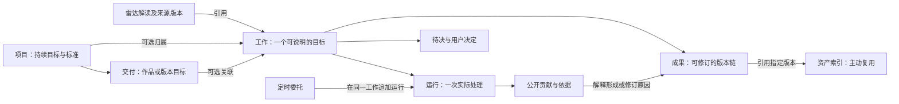

# 对象关系与交互契约

统一确认入口：[UI 与交互确认稿 v1](UI-BASELINE.md)。本文保留对应领域的详细规则。

2026-09-16，根据用户要求重新从功能关系推导界面。本文是设计契约，实现覆盖与现场验证见 [交付记录](DELIVERY.md)，不以规格存在推断功能已完成。PRODUCT 定义目标与能力，本文统一对象和动作，PAGES 决定呈现；视觉稿不能反向增加功能。

## 1. 当前问题与取舍

旧规格有“不堆模块”的原则，但对对象的创建、复用、归属和状态影响缺少可执行规则。24 张稿覆盖了功能名称，却不能证明完整路径成立。减少边框只能缓解表面问题。

| 关系缺口 | 导致的界面问题 | 本次决定 |
| --- | --- | --- |
| 项目和具体工作都有聊天入口，却未说明接续谁 | 项目对话、作品继续、三窗口入口互相竞争 | 项目选中交付后明确接续其工作；另开目标必须明确显示“新工作” |
| 缺依据、用户待决、运行失败混成“待处理” | 每条状态都占一块提示区 | 材料缺口就地标注；只有需要用户选择或补授权才能推进时才提出待决 |
| 成果、作品、工作和资产并列展示 | 同一脚本反复出现，仿佛四份文件 | 成果只有一个版本链；其他入口展示引用；资产是主动整理的复用索引 |
| 雷达阅读和团队研究没有清晰切换点 | 每篇文章旁都像已经有一项任务 | 阅读不创建工作；首次发送目标才创建，返回时保留原文位置 |
| 团队过程按成员或固定步骤摆卡片 | 有角色、状态，缺少为什么改变结果的关系 | 过程按实际问题组织证据、分歧与修订；成员是贡献者而非栏目 |
| 每个能力都对应页面和按钮 | 主操作被配置、管理与工具淹没 | 先确定对象和阶段，再决定动作；配置只在需要时展开 |

## 2. 统一关系，界面不暴露数据库结构

- **项目**回答长期为什么做；**交付**回答这次想交出什么；**工作**回答当前和团队要解决什么。简单工作可独立，不要求先填完三层表单。
- 一项工作最多有一个所属项目、一个可选交付。交付必须在该项目内。雷达议题、来源、其他成果和资产都是可多选引用，不与项目争夺所有权。
- 一个交付可关联几项不同目标的工作；“当前继续的工作”使用用户最后明确选择或固定的工作，不能根据标题相似度偷偷合并。无明确选择时显示工作列表，不猜测。
- 成果由工作产生，同一成果修订保留身份和版本链。项目交付选择某个成果版本作为采用版本；新草稿不会自动替换已采用版本。多个成果确有不同用途才分开。
- 正式项目文件保持原位置和版本依据。导出副本不是实时同步，外部修改先比较；“保存到项目正式资料”与自动保存草稿分开。
- 自动保存负责防丢，不要求用户再点“保存为资产”。“加入资产”只增加带用途、来源、版本的索引；使用时绑定准确版本。整理成方法是明确生成一份新成果，不能把普通收藏当成学会方法。
- 首页、项目、雷达和通知是这些对象的投影。不得各保存一份独立任务状态、对话或成果。

## 3. 入口必须先说明这次在做哪件事

| 入口 | 发送前显示的目标范围 | 发送后的对象 | 离开与返回 |
| --- | --- | --- | --- |
| 首页底部 | 新工作；所选材料；归属可选 | 首次发送建立独立工作或明确所选项目工作 | 返回首页仍是新工作入口；原回复从继续工作找回 |
| 首页“继续工作” | 已有工作名称 | 原工作；不创建运行 | 回首页保留列表位置 |
| 雷达解读提问 | 新工作 · 引用本篇解读的准确版本；可移除引用 | 首次发送创建工作；同一轻对话后续发送复用该工作 | 返回保留文章位置；已有讨论单独列出，不按文章自动合并所有讨论 |
| 项目当前交付 | “继续：脚本修订”等准确工作名称 | 原工作追加交流；不是“和整个项目随便聊”的第二线程 | 回到同一项目与交付 |
| 项目“开始另一项工作” | 新工作 · 当前项目；可选关联交付 | 明确的新目标，首次发送创建 | 新旧工作均可找回，互不覆盖 |
| 成果选段修改 | 原工作、成果版本与选段 | 原工作中的修改请求 | 回到同一成果的新旧版本对照 |
| 资产“用于工作” | 选择已有工作或明确新工作；资料范围可见 | 先放入草稿引用，发送才调用团队 | 取消不运行、不复制成果 |

同一时刻只有一个编辑中的输入上下文。轻对话打开后沿用该输入，不同时保留一个含糊的全局输入和一个局部输入。切换上下文保存旧草稿并清楚更新工作名；不能把未发出的文字悄悄送进另一项工作。

展开团队工作区是视图切换，以始终可见的图标操作承接，提示中解释三工作面。未发送时携带本地草稿展开，首次发送才创建工作；已有工作展开保留同一身份。发送快捷键、展开、返回、切页签都不得重复提交。仅存在附件且没有目标时允许先整理草稿，不自动启动全套分析。输入和执行状态的具体规则见 [COMPOSER.md](COMPOSER.md)。

## 4. 动作的效果必须可预测

| 动作 | 改变什么 | 不产生什么 |
| --- | --- | --- |
| 阅读、切页签、展开、返回 | 当前视图与阅读位置 | 工作、运行、费用 |
| 收藏解读、加入资产、关联项目 | 书签或引用关系 | 新副本、模型处理、全项目读取授权 |
| 保存雷达议题与筛选规则 | 保存材料范围与筛选意图 | 模型调用、团队工作 |
| 整理议题 / 检查更新 | 对所选范围进行解读检查；同输入复用已有成功检查，新理解形成新版本 | 自动创建团队工作、无变化重复生成文章、覆盖旧引用 |
| 发送新目标 / 追问 / 修改请求 | 持久消息；需要处理时建立一次运行 | 无关新工作、自动发布、自动采用新成果 |
| 让 AI 重新整理 | 把整版或选段的准确引用与整理要求加入原工作草稿，保留已有输入 | 自动发送、直接编辑文件、覆盖历史版本 |
| 采用此版本 | 交付所采用的准确成果版本 | 发布、外部执行、证明有效 |
| 导出 | 所选版本文件及导出记录 | 团队运行、已发布或已验证状态 |
| 设为定时任务 | 带目标、范围与触发的委托草稿 | 立即执行；确认启用后才调度 |
| 换团队 / 流程 | 独立保存版本，应用兼容组合后用于未来新提交 | 改写历史或已排队快照、切换布局、重跑当前轮 |

范围可从上下文推导时直接准备，不增加每次发送的确认弹窗。只有存在互相冲突的目标、不可替代的授权缺口或会改变交付含义的歧义，才在原输入中集中问清。

## 5. 缺口、待决和失败不是同一种东西

**材料缺口**属于证据或成果中的具体位置。例如“案例仅有摘要”：团队应标注限制，继续完成允许的部分；不自动把它变成首页待办，更不能强迫用户去完成团队本可做的核查。

**待决事项**属于工作，包含问题、为什么必须由用户决定、影响范围、可选方向及建议依据。例如“离线导入是否纳入首版”会影响版本范围，应由用户选择。普通问答和每次生成成果不默认等待批准。

- 待决状态为待答复、已答复、已撤回/被替代。首页仅引用未答复且确有影响的事项；同一事项只显示一次。
- 用户答复写入原工作，并记录适用目标/版本。选择方向只准备答复，可自由改写；明确发送才生效。普通未发送草稿独立保留。原运行等待该答复时通过原恢复点继续，不把答复排进普通下一轮补充；重复点击只接受一次。已经过时的问题先展示变化，不把旧答案应用到新目标。
- “稍后处理”只影响提醒，不表示解决；只有该待决是必要前提时，相关运行才等待用户，其他可做的工作继续。
- 运行失败属于当轮运行：保留已产生内容，展示重试或调整输入。结果未知先找回状态，不直接重试付费调用。全局连接异常不拆成每个页面的一组红色事项。

## 6. 工作、运行、交付各自结束

| 层次 | 状态依据 | 呈现位置 |
| --- | --- | --- |
| 运行 | 排队、处理中、等待用户、成功、失败、取消待确认、已取消 | 原工作中的当轮状态；过程详情 |
| 工作 | 进行中、已完成、已归档，由目标是否达成及用户操作确定 | 工作索引与项目当前工作 |
| 成果 | 当前草稿、准确版本、待核处、采用版本、实际交接/使用记录 | 成果正文与版本信息 |
| 交付 | 目标与采用的成果；实际交付/发布证据 | 项目交付对象 |

运行成功只说明这轮处理结束。用户可直接使用成果，无需为每份结果批准；“采用为交付版本”用于项目交付的明确版本选择。完成工作会保留全部过程，后续继续时复用原工作并记录重新打开；归档仅影响默认列表。离开页面不取消运行。

定时委托固定关联一项工作：每次触发产生独立运行与观察区间，追加结果版本，不新建聊天。无新信息仅保留检查记录。编辑委托影响后续触发，暂停与停止当次分开；工作管理入口明确说明：完成或归档会同时暂停关联委托；恢复工作后自行重新启用，不能让任务无入口地继续。

## 7. 团队可视化围绕变化的原因

过程的阅读单位是正在解决的问题，不是强制四个角色各一张卡。每组有问题、负责成员、证据、分歧、处理结果及所影响的成果位置。仅真实依赖使用连接线；某成员没有参与就不占位。

例如“第二步的依据够不够”：研究员给出材料读取范围 → 核查员指出只有摘要 → 编辑员保留待核措辞并修改 v3 第二段。用户可以打开依据、追问该判断、定位修订段落；决策面只呈现团队结论和需要用户处理的取舍，不重复整份过程。

团队搭配与流程分别版本化。配置是次级操作，不是开始门槛；已提交的运行（含待发）使用固定快照，升级作用于之后的新提交。三工作面排列只属于视图，和角色数、阶段数、运行状态无关。

## 8. 用路径检验功能是否该出现在界面

### 阅读进入创作

1. 首页读重点观察 → 打开原解读。只是阅读，工作数和运行数不变。
2. 输入“结合这篇材料写一条三分钟脚本”，选创作实验室或暂不归属。发送建立工作，引用解读准确版本；不自动读取整个项目。
3. 轻对话获得团队回应 → 展开三窗口。工作和运行保持原值。
4. 过程定位摘要证据不足，结果保留待核措辞。该缺口不自动阻塞或制造用户待决。
5. 用户选第二段要求调整语气 → 原工作新一轮处理 → 同一成果形成新版本。旧引用与用户编辑不被覆盖。
6. 在项目采用某版本，后续从交付行打开它；工作保留更新草稿。导出是明确动作。
7. 需要复用时加入资产，下次引用准确版本。自动保存不重复做一次“入库”。

### 接续软件项目

1. 项目概览选“首版产品定义”，继续其范围讨论工作，不从底部再开一个含糊项目聊天。
2. 用户处理“是否纳入离线导入”，答复影响该版本的范围；首页同一待决随之消失。
3. 团队修订产品定义，用户采用版本并导出交接。未取得外部执行证据时项目不能显示开发完成。

### 验证要求

逐步记录当前对象、主操作、返回位置及动作前后的工作数/运行数/成果版本。额外覆盖：未发送即展开后退出、重复发送、多个关联工作、来源更新、运行中切页、草稿冲突、模型不可用、旧待决失效、定时与手动运行重叠。定时与手动修改同一成果时串行提交或显式处理版本冲突，不后写覆盖。

文字规格只能证明规则明确；静态图只能检验层次。上述连续路径在可操作原型和真实运行中完成之前，不宣称交互验收通过。

## 9. 关键视图共用的验收样例

这些是设计用例，不是用户数据或真实运行。视觉生成器不能为各页自行扩写成不同案例。

- 项目：创作实验室；作品：把收藏整理成一条脚本；工作：脚本修订；本轮请求：把第二段改得更口语，保留证据限制。
- 材料：方法笔记全文（设计示例）；交接案例摘要（仅摘要，原文待补）。没有实验、提升百分比或已验证效果。
- v3 第二段：整理材料时，应区分原文与摘要。摘要可以帮助筛选，但不能替代原文核查。当前案例只有摘要，因此暂不据此推导普遍结论。
- v4 第二段：先别急着把收藏当成结论。我们手里这条案例目前只有摘要，可以先看看它有没有用；真要拿来支撑观点，还得回到原文核对。
- 首页与项目呈现发送前的 v3；过程的修改前/后分别引用上述两段；结果呈现本轮完成后的 v4。过程/结果是同一工作同一时刻的两个页签，布局、目标、请求和运行状态相同。
- 项目当前尚未采用成果；采用 v4 后才更新项目的采用版本，作品仍未发布。缺摘要原文保持行内限制，本轮口语修订不因此等待用户。

在图稿中发现重复输入、同一版本正文不一致、切页签切成另一种产品壳或编造完成状态，都按交互问题退回，不用改颜色掩盖。

修订、选中和待核是三种不同事实：v4 第二段已修改不等于当前被选中，原文待补也不代表正在等待用户决策。默认正文用文字注记表达修改和限制；选段操作才出现针对该选择的工具。用户明确禁止以左侧亮条表达任一种状态，具体视觉约束见 DESIGN。

### 独立配置的生效边界

团队搭配与协作流程各自保存不可变版本，保存后需选择兼容组合应用。全局默认仅影响新工作；已有工作使用自己的组合，可单独升级或选择历史兼容组合。已提交及排队的运行固定原配置，更新用于之后的新提交。重命名成员不改写历史贡献。配置保存和切换不启动模型。

工作改名保留身份；归入项目/交付保留草稿、运行与成果。调整归属前需处理未结束运行；成果已被交付采用时，先在原交付明确解除采用，防止原交付悄悄指向其他项目。解除采用保留成果和版本，不是删除。交付只有一项相关工作时直接接续，多项时明确选择，不能因点击交付而重复新建工作。

## 公开过程的后续动作（2026-09-17）

过程可按整个工作或指定轮次回看，也可勾选记录形成总结/复盘范围。每条记录显示当时成员、任务、真实状态，轮次保留团队和流程版本及所用资料；没有公开分析时明确为空，不编造补齐。

- 追问此处：准确记录或选段 → 同一工作的解释草稿 → 用户发送 → 交流回答。主成果与采用关系不动。
- 总结过程：指定记录范围 → 总结草稿 → 用户发送 → 独立过程总结版本链。
- 复盘工作：指定记录及相关用户输入、决定、准确成果版本 → 复盘草稿 → 用户发送 → 独立工作复盘版本链。

支持成果与主成果可在结果选择器中切换、分别比较和让 AI 重新整理；总结/复盘不能作为交付主成果采用。结果中的“查看依据记录”回到实际使用的过程记录。保存版本和引用不受之后过程增长影响，过大范围在准备时明确拒绝，用户可缩小到一轮或所选记录。过程不包含未公开内部推理，用户意见不自动成为已验证效果或长期标准。

## 项目建议回写（2026-09-17）

项目页只设置固定建议位置和查看最近写入。具体建议从成果的“写入项目建议”图标进入，携带当前成果版本或准确选段；对话框只读展示待追加内容、来源和保留的原文。明确预览后才能追加。内容要修订时返回原工作交给 AI，不在对话框提供文件编辑器。

文档在预览后变化时，取消本次写入并提示重新预览；新预览展示外部追加，确认后保留其内容。重复操作同一成果范围不重复记录；选择更新的 AI 成果版本会追加新建议，旧建议和证据继续保留。写入成功只表示文档中已记录，不意味着开发工具已执行或用户已采纳。

## 软件项目初始化（2026-09-17）

尚未关联目录的软件项目提供“初始化本地项目”。先选择已有团队成果和稳定 ID/系列，再预览正文、接续文件、规则与实际路径；改动输入即取消旧预览的可执行状态，关闭后保留输入。正文只能通过原团队工作修订，不在初始化表单中编辑。

用户确认采用预览内容后，创建本地初始提交、main/dev 工作树和中央登记。成功显示开发目录，并允许从项目页继续读取与回写建议；不显示为业务开发完成。中断时显示真实停留步骤，明确“检查并继续原初始化”才恢复，冲突不自动覆盖。界面保留初始化历史供回看，不因新成果生成而改写已交接文件。

项目初始化缺少本机规则时，提供进入目录与规则设置的入口，保留原项目初始化表单。设置先检查当前 AI/Code：已有规则沿用；空体系可预览基础约定、全部目录和两处规则入口，再明确建立。创建完成后返回原项目继续预览和初始化。已有损坏/异构规则不自动覆盖，原因显示在当前流程中；只选择根目录不会隐式建立规则。

### 成果交接与反馈

主成果工具栏以图标进入“交接与反馈”，标题固定当前版本。接收对象与用途是检查的必要输入；“检查是否准备好”只准备原工作草稿，保留用户已写内容，发送后形成独立检查意见。已有检查报告从同一面板打开，仍标明 AI 意见；主成果保持原样。

交接、使用反馈、验证记录、待修订分别填写，不必走完全部状态。反馈可以附上已读取的材料版本或准确选段，也可以导入本地文本证据。保存成功显示为用户记录；没有附件时明确仅有陈述。其他版本的记录不会继承到当前版本。填写错误可说明原因后撤回，历史内容仍可回看。

“带回团队复盘”引用原轮次和成果及当前已记录反馈，在原工作准备独立复盘；发送前可以继续补充。反馈新增或撤回后，具备反馈快照的检查/复盘报告提示“反馈记录已变化”，不能把此前意见当成已经处理了最新反馈。修订主成果、采纳项目标准、保存跨项目方法仍分别执行。

### 按需团队协作

团队与流程设置中可选择“按需协作”，或在流程新版本中启用委派并设置次数/层级上限；更改搭配和更改流程分别保存、明确应用。简单目标由负责人直接回应，有必要时才增加研究、核查等子任务，不以每人必须发言作为完成条件。

过程面把子任务折叠在发起委派的成员记录下，展开可见限定问题、准确材料、完整公开分析和真实状态。负责人收到回信后的继续处理独立显示并关联回信；子任务失败不显示为分析完成。现有轮次筛选、针对单条分析的追问和总结复盘仍有效。针对子任务准备讨论时，只引用该子任务实际获得的材料，不因所属轮次还有其他资料而扩大输入范围。

### 方法从资产进入工作

资产页以方法列表呈现内置、本地导入和独立副本；详情使用版本选择和图标操作，支持复制、编辑副本新版本、源文件检查、导出与启停。编辑对象是可复用方法，不是成果文件。版本升级不会静默替换成员搭配中绑定的旧版本。

底部输入栏的书本图标打开本轮方法选择，指定后显示可移除的名称标签，与目标和材料共同保存为草稿。发送时冻结准确版本；指定方法被停用或依赖缺失时不能发送，用户更换或移除即可继续。团队与流程中的成员方法选择决定可供该成员按需使用的额外方法，保存搭配版本并应用后用于后续提交。过程面显示方法名称、版本、加载用途和当时正文，准备加载与实际请求载入分开呈现。

### 方法草案、试用与采纳

成果工具栏的书本图标可把当前工作的过程与修正整理为方法，过程面也可从所选范围发起。两者只准备输入草稿；明确发送后，结果面出现独立“方法草案”版本。方法草案可用已有 AI 修订和版本比较，不增加结果文件编辑器。

方法草案提供“试用此方法”，选择独立工作或项目归属后进入保留方法标签的新工作草稿，由用户补充实际目标与材料再发送。资产页能返回准确来源成果、查看试用轮次；完成试用后，用户记录理由及适用限制，采纳准确版本。采纳状态与效果验证分开，新的方法版本不继承旧版本采纳。未采纳草案不会混入成员常用方法选择。真实成果中生成的表格使用统一 Markdown 表格渲染，窄工作面可横向阅读。

### 已接通的本机定时管理

列表新建和工作菜单“设为定时任务”共用表单。默认关注目标、结果归属和时间，沿用实际团队与方法，详细配置折叠；明确本机执行条件、请求上限和已读资料范围。周期是实际小时，不用“每天固定钟点”混称。无新材料只记录检查，立即运行明确会再次调用模型。

列表显示项目、启用与运行状态、下次时间、最近检查；历史通过准确 Run 定位成果版本。暂停后续与停止本次是独立图标，停止/失败造成原工作队列暂停时须先回原工作处理，不悄悄重启。需要答复、权限变化和未知结果回到同一原任务；首页按工作归并，避免与继续工作重复呈现同一异常。

### 我的来源与持续议题

雷达的“来源与议题”提供“我的来源”。先填写公开 RSS/Atom 地址并识别预览，再选择是否在应用运行时自动更新。普通网页明确说明不是订阅；失败不变成空结果。来源行以图标提供刷新、暂停自动检查、编辑和停用；历史可查每次新增、修订、未变和未纳入范围。停用保留材料，并可恢复为手动更新。

议题可明确绑定订阅，整理时纳入其已读取新近文章，不要求每次手选新条目。用户控制每次篇数，手选重要材料优先，旧解读保持当时的准确来源版本。订阅更新与模型整理分开：可手动整理，也可另行开启议题自动整理；设置来源自动更新不等于授权自动生成解读。

议题旁的时钟图标管理自动整理；定时任务页呈现同一设置、检查状态及准确解读入口。开启时明确当前规则版本、材料范围、检查间隔、滚动 24 小时的自动模型提交上限与本机运行条件。首次开启开始检查，之后按间隔判断当前输入；没有材料变化不调用模型，模型判断没有新增理解则不创建新解读。手动整理不计入该自动上限，也不会因自动暂停而被禁用。

更新议题规则会原子暂停原自动设置；需重新查看并保存后才继续。服务连接变化、确定失败或未知结果暂停后续，不抹去旧版或暗中重试。未知结果回原议题核对同一运行。暂停后续不取消正在整理的这一轮；已有阅读位置、选中的旧版与收藏不被新结果抢走。应用退出时不会执行，重启只检查一次当前材料，不补造离线期间的观察。

### 备份与空间

设置页提供备份和恢复图标。备份保存当前已读内容及工作关系；恢复先展示工作、项目、成果版本、草稿、材料、雷达与方法数量，再命名新空间。恢复完成后当前页面仍属于原空间，用户打开新空间时提示应用会重启；原空间始终可从列表返回。

恢复不产生新模型请求。自动设置暂停，旧文件写入预览不能继续执行。普通页和沉浸式工作区都显示恢复空间名称；恢复后的草稿修改只作用于当前空间。原 AI/Code 路径与当前配置不一致时重新选择，不猜测映射。服务凭据不随文件恢复，离线可直接核对已有成果、材料和引用。

## 独立模型连接补充（2026-09-17）

模型选择属于工作执行配置，信息服务属于材料与同步连接；两者可以独立存在。更换模型连接不清空工作、材料、草稿、团队配置或历史成果。未结束工作与雷达作业阻止切换；自动委托绑定原模型 scope，切换后需检查范围并重新保存授权。

自带 API 的正常完成以提供商文本流完成原因及本地完整接收记录为依据。直连中断只允许核对原本地记录；不能用“重试”隐式提交相同付费请求。确认结束本地等待时，工作本地状态可结束，调用记录仍保留未知与部分正文，后续队列继续暂停。新目标或修订必须由明确的新提交发起。

## 服务账号与本机空间

设置中的“账号与服务”接入已有邮箱账号。登录后显示账号和服务连接状态，检查与退出使用带可访问名称的图标；独立访问令牌收在次级展开区。服务地址可以调整，但不自动迁移工作或目录。密码提交后立即从输入框清除，不回填保存的凭据。

登录成功而没有产品权益时显示“已登录，当前账号尚无 ytriple 服务权限”；用户仍可阅读本地内容、检查连接、退出或使用自己的模型。账号退出不删除项目、草稿、成果或本地路径，旧运行保留原服务范围。存在未结束的服务运行时先处理原运行，再退出或切换；自带模型的运行不因服务账号操作切换提供商。

重启恢复已加密会话；会话刷新中断或无法解密时显示需重新登录。退出后重启保持退出，不能暗中恢复旧访问令牌。若本机退出成功而服务端撤销未确认，明确区分两者。
