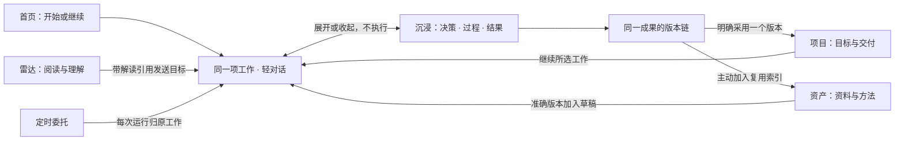

# ytriple · UI 与交互确认稿 v1

2026-09-17 整理版。本稿汇总已收敛的产品界面与功能逻辑，作为统一确认入口。确认范围是页面职责、视觉规则、工作关系和关键交互；不把静态设计当作功能已实现，也不在这里确认开发阶段或发布进度。

## 2026-09-17 实现修订：先收口 UI

用户当前要求只改善既有 UI 与交互呈现，功能扩展保持暂停。本节覆盖下文与之冲突的固定输入框描述；不表示用户已经验收新外观。

- 页面层级：首页是工作接续与高权重雷达；项目分为概览/交付和资料；资产分为成果资料、方法工作流、本地目录；设置按服务、目录、空间、团队切换。次级管理不再全部摊在首屏。
- 对话入口：首页和项目概览默认单行轻入口，聚焦输入或已有草稿、材料时展开。雷达阅读需主动带入解读才出现输入；项目资料、资产浏览、设置不强放聊天框。
- 输入上下文：显示当前工作、项目/交付或所选解读；材料、成员、处理状态共同决定提示。处理中保留停止与下一轮补充，待决继续使用原有专门答复控件。入口变化不新建运行、不自动发送。
- 空间关系：输入区属于工作空间的底部布局，随侧栏和内容区宽度变化，不覆盖页面末尾。进入已有工作后聚焦轻对话，可直接展开团队工作区；收起返回所属页面。
- 表现：亮色中性基底、浅色区面、图标工具、明确的主动作；禁用左侧亮条。成果摘要渲染格式，不直接截出 Markdown 源码。完整成果和解读仍按正文阅读。

## 图标、比例与协作可视化修订

- 主品牌使用历史 `3878808` 的三条竖线图形（保留高低、倾斜与绿色配色）；应用安装图标采用相同图形。树枝形 Y 专用于 macOS 顶部菜单栏，菜单只提供打开和退出，不改变关闭窗口即退出的运行规则。
- 首页工作项突出目标、真实成员协作记录与团队工作区入口；节点反映已保存的记录顺序和状态，不固定为三名成员，不推断完成百分比或委派依赖。
- 雷达保留较高版面权重，摘要、解读脉络与材料依据分层。材料入口读取该来源版本，完整解读从标题或阅读入口进入。
- 过程先显示可点击的协作概览和成员任务，长篇公开分析按需展开；从首页点成员直接定位并展开对应记录。完整分析保留原文，不通过 AI 新生成摘要填充界面。
- 字号、标题宽度、卡片间距与协作区比例共同调整；小窗口允许单列和记录横向滚动。保留亮色、图标工具和无左侧亮条约束。

本轮仍属于外观与现有信息的呈现修订，不代表用户已经确认整体 UI。

## 确认速览

本次整理为一套方案，后续页面沿用同一套关系与组件。本文为待确认基线，不将“整理完成”记录为用户已经验收。

阅读本稿即可确认整体方案，不需要逐份确认所有详细文档。确认包括页面职责、信息层级、底部入口、工作连续性和视觉约束；具体项目名、角色、条目数量与图中样例不固定。实现完成度单独以交付记录为准。

| 确认项 | 收敛结果 |
| --- | --- |
| 整体风格 | 亮色、中性、克制；保留左侧汉堡导航。用文字主次、对齐和留白组织内容，减少边框；全局禁用左侧亮条与同类装饰 |
| 首页 | 有内容的 Dashboard：继续工作与高权重雷达观察形成主次，底部可以直接开始工作 |
| 领域页面 | 雷达负责阅读理解，项目负责持续目标与交付，资产负责复用；每页有自己的阅读顺序与主动作 |
| 核心特色 | 团队协作可以随时展开为决策、过程、结果；默认左决策、右侧过程/结果切换，也允许三面自由排列 |
| 底部入口 | 工作身份、按需出现的材料、多行输入、四个常用操作图标；发送与展开分开，配置和解释放入相关菜单 |
| 连续性 | 草稿、工作、引用和成果版本跨页面保持同一身份；团队搭配与流程独立，调整不改写正在执行的运行 |

主要使用路径是“读到信息或提出目标 → 与团队推进 → 必要时展开协作 → 形成并修订成果 → 用于项目或复用”。来源管理、团队配置、版本历史与定时委托只在相关位置展开，不变成每页常驻的管理区。

确认稿中的完整页面范围不要求每个功能同时出现在界面上。复杂能力按需呈现，未就绪能力不显示可点击但无实际作用的按钮；后续开发状态单独记录在 [交付记录](DELIVERY.md)。

### 界面按三层组织

| 层级 | 用户看到什么 | 展开条件 |
| --- | --- | --- |
| 日常页面 | 首页接续与雷达阅读、项目交付、资产复用；各页保留自己的主动作 | 启动和日常浏览，不强制进入聊天 |
| 当前工作 | 明确的工作名、引用、团队回复与底部输入；工作区图标直接可达 | 用户开始或继续一件事 |
| 按需工具 | 材料预览、版本比较、团队与流程、来源管理、定时委托 | 用户操作相关对象时打开，结束后回原位置 |

沉浸工作区展开的是第二层的同一项工作。底部输入不是全局命令栏：正在给谁、围绕哪件事、带了哪些材料必须可辨认；打开它不等于读取整个项目，也不等于开始执行。

### 收敛后的界面取舍

- 首页的丰富度来自正在推进的工作和可直接阅读的雷达内容。不给每个功能安排一个等大的模块，也不靠统计数字补空位。
- 雷达、项目、资产保留不同的主动作：阅读、推进交付、复用。团队输入在明确工作上下文后出现，不覆盖领域页面的主要任务。
- 工作区入口在输入工具行中直接可达；进入后展示同一工作的决策、过程、结果。没有另外一套“三窗口任务”。
- 高频动作图标化，工作名、准确引用和异常原因仍使用文字。首次使用不先配置团队、模型或流程。
- 配置、历史和管理操作按对象展开；只有明确影响当前动作的状态才进入首屏。

## 1. 产品与界面的共同中心

ytriple 是 AI 工作台。用户可以直接阅读雷达、推进项目，也可以从一句话开始工作。团队的决策、过程和成果可以互相对照，是核心体验；三工作面属于具体工作，不占据整个产品的所有页面。

正常启动进入首页。左侧汉堡导航承接首页、雷达、项目、资产、定时任务和设置；进入沉浸工作区后收起全局导航，保留工作身份与返回入口。

| 对象 | 用户需要理解什么 | 界面必须守住的关系 |
| --- | --- | --- |
| 项目 | 长期为什么做、遵循什么标准 | 可以包含不同交付与工作，不等于一个万能聊天 |
| 交付 | 这次要交出的作品或版本 | 指向明确采用的成果版本，新草稿不自动替换它 |
| 工作 | 当前与团队要解决的问题 | 可独立存在；最多归属一个项目、关联其中一个交付 |
| 成果 | 实际形成的内容 | 修订保留同一身份和版本链，跨页打开不是复制 |
| 材料与资产 | 本次参考什么、以后复用什么 | 引用带来源、版本和范围；收藏不等于已验证或已执行 |

首次明确发送才创建新工作；继续已有工作复用原身份。简单目标不要求先建项目、填交付或配置团队。

## 2. 全页面的职责与入口

以下覆盖产品的完整页面逻辑。表中的详情、页签和菜单是各领域内部层级，不全部升级成左侧导航。

| 页面 / 层级 | 主要内容与排版 | 主要动作 | 对话与返回规则 |
| --- | --- | --- | --- |
| 首页 Dashboard | 继续工作与高权重雷达观察；重点内容和短内容有阅读层次，待决附在所属工作 | 继续工作、阅读解读、开始新工作 | 底部默认“新工作”；继续某项后改为该工作；退出恢复首页位置 |
| 全部工作查找 | 工作名称、归属、实质进展与必要状态；包含独立工作 | 查找并继续 | 定位已有工作，不另建会话；由首页查找进入 |
| 雷达观察 | 重点解读、短解读、议题筛选与真实来源覆盖 | 打开阅读 | 列表不强放对话框，不因阅读创建工作 |
| 雷达解读 | 连贯正文、原文引用、限制与相关工作 | 阅读、收藏；需要时围绕解读开展工作 | 正文末入口展开输入并带准确解读版本；返回保留阅读位置 |
| 来源与订阅 | 已关注议题、来源、读取状态与订阅条件 | 添加、调整来源或订阅 | 雷达内管理入口；读取失败与无更新分开 |
| 项目列表 / 新建导入 | 名称、持续目标、当前交付；新建/导入为列表工具 | 打开项目、新建或选择导入范围 | 创建不触发全量扫描；不在每行复制聊天入口 |
| 项目概览 | 目标摘要、当前交付、采用版本、实质变化、相关工作 | 继续明确工作，或开始另一项 | 输入标明工作名；不清楚接续谁时先选择，不猜测 |
| 作品 / 版本列表 | 媒体的作品、软件的版本或交接目标 | 打开交付，查看采用版本与相关工作 | 使用同一交付逻辑；不因项目类型复制聊天系统 |
| 项目资料 | 原始材料、正式资料、引用与草稿；列表和预览 | 阅读、选择引用范围 | 选择不等于发送或上传；加入草稿后才成为候选上下文 |
| 成果阅读器 | 完整正文、指定版本、依据与必要待核处 | 选段修订、编辑、比较、导出；项目内可采用版本 | 项目、工作、资产共用阅读器；修改带版本回原工作 |
| 轻对话 | 本轮目标、团队答复、当前输入 | 提问、补充、展开工作区 | 是原工作的一种视图；同一时刻只保留一个输入上下文 |
| 沉浸工作区 | 左决策、右过程/结果切换；可自由排列三面 | 交流、追问依据、修订成果 | 返回原入口与阅读位置；排列、页签不影响执行 |
| 团队与流程 | 两组独立配置：成员搭配、协作流程 | 查看或调整下一轮配置 | 工作内次级入口；不是首发目标前的必填表单 |
| 资产列表 / 详情 | 用户主动收集的资料、成果和方法；用途、来源、适用条件 | 打开、用于工作 | 选已有或新工作，把准确版本放入草稿；不复制成果 |
| 定时任务列表 / 详情 | 做什么、触发方式、实际状态、最近结果与运行记录 | 查看结果、调整、暂停后续、停止当次 | 每个委托固定关联一项工作，各次结果定位准确版本 |
| 新建定时委托 | 目标、触发、材料范围、执行位置、结果归属 | 保存并明确启用 | 从原工作进入可带入已有内容；启用前不调度 |
| 设置 | 服务/模型、能力/权限、数据/设备、通知/外观；共用设置壳 | 配置实际使用条件 | 从工作中定向进入后回到原草稿；不显示未实现的成功状态 |

首页不独立堆放团队活动流、重复成果、普通材料缺口或健康面板。雷达以阅读为主，项目以交付为主，资产以复用为主；不同领域不套同一种卡片网格。

## 3. 底部对话入口

同一组件适配首页/项目的宽输入与决策面的窄输入。由上到下是当前工作、按需出现的引用、多行正文、图标操作行。工作身份保持文字可读，普通操作不重复配长解释。

### 哪些页面显示输入

| 所在位置 | 默认入口 | 打开后归属 |
| --- | --- | --- |
| 首页 | 底部新工作输入常驻；已有工作从“继续”进入 | 新草稿或明确选择的已有工作，不能由列表选中态暗中决定 |
| 雷达列表 / 解读阅读 | 列表保持阅读；解读正文末提供开展工作入口 | 点击后才展开带准确解读版本的输入；已有讨论从相关工作进入 |
| 项目列表 / 项目概览 | 列表打开项目；概览先明确要接续的工作，或选择开始另一项 | 明确工作及项目归属；没有选择时不显示含糊的项目聊天 |
| 资料 / 资产 / 成果阅读器 | “用于工作”或选段操作 | 资料先选工作；成果修订回原工作；准确版本加入该草稿 |
| 轻对话 / 沉浸工作区 | 当前工作输入常驻；沉浸时只在决策面编辑 | 同一工作、草稿、交流对象和引用 |
| 来源管理 / 定时任务 / 设置 | 使用各自管理操作，不常驻聊天框 | 明确打开关联工作才进入工作输入；返回恢复原管理位置 |

从阅读页展开输入后，正文末入口与底部输入合为一个编辑上下文，不同时出现两套可输入内容。关闭输入保存草稿并回到原阅读位置；重新打开恢复原草稿。首页、不同解读和不同项目的新工作草稿按入口分别保留，不能共用一份“新工作”草稿而互相覆盖。工作创建后，草稿归工作身份管理。详细切换规则见 COMPOSER。

### 工具行

| 入口 | 功能 | 必要反馈 |
| --- | --- | --- |
| 工作名称与下拉箭头 | 查看归属、切换工作、开始另一项 | 先保存旧草稿，明确新上下文，不搬走旧草稿 |
| 加号 | 文件、链接、已有材料；方法选择放次级分组 | 引用可预览/移除，显示真实名称与版本；失败材料不会静默漏传 |
| 双人图标 | 默认与团队交流，可指定已有成员 | 指定时显示一次“@成员”；不另开成员聊天 |
| 工作区图标 | 展开或收起同一工作的三工作面 | 始终直接可达，草稿与引用保留；不发送、不新建运行 |
| 向上箭头 | 发送当前目标、引用与交流对象 | 空输入或材料未就绪禁用；重复提交只接受一次 |

不常驻模型、人数、网络开关、Skill 标签墙、键盘教程；没有语音能力不放麦克风。菜单选项保留文字，图标提供悬停/聚焦提示和可访问名称。

| 状态 | 呈现和动作 |
| --- | --- |
| 空输入 / 只有附件 | 发送禁用；可整理材料、展开工作区，写明目标后再发 |
| 可发送 / 提交中 | 可发送时箭头强调；提交中防重复，保留输入快照 |
| 处理中、无补充 | 简短“处理中”，发送位变停止方块 |
| 处理中、有补充 | 停止与发送并列；发送旁注明“下一轮”，点击后才排队 |
| 已排队 | “待发 1”等可查看、编辑、撤回；仅本轮成功且无待决/停止/失败时顺序续发 |
| 等待本人决定 | 显示具体问题，答复绑定原待决与版本并接续原运行，不进普通补充队列 |
| 附件失败 | 在该材料上显示短错误、重试与移除；修复或移除前不可发送 |
| 发送失败 / 服务不可用 | 保留草稿与引用，就地恢复；未知提交先核对状态，恢复连接不自动发草稿 |

停止当前轮也暂停待发队列，不删除待发补充。切换页面不停止工作，切换工作不把排队内容带进另一项工作。此处的关闭指关闭视图；退出整个应用后的持续执行取决于实际运行位置，不能把本机模式宣传为离线后台持续运行。

编辑待发补充时暂停该工作的自动续发，当前运行照常继续；编辑草稿与主输入分开保存。保存或放弃编辑都不偷偷恢复队列，由用户明确继续。已经开始处理的提交不能再当作待发内容改写。团队/流程更新只用于更新之后的新提交，之前已排队的补充保留提交时配置。

Enter 换行，Cmd/Ctrl+Enter 发送，中文输入法合成期间不触发提交。Esc 关闭当前弹层并恢复焦点，不清空输入。输入变长可增高再滚动，页面预留底部空间，材料区不能挤掉正文与按钮。

## 4. 团队三工作面的分工

| 工作面 | 主要回答 | 对其他工作面的连接 |
| --- | --- | --- |
| 决策 | 目标是什么、团队结论是什么、是否真的需要本人决定 | 可追问具体判断，打开相关过程或成果 |
| 过程 | 谁围绕什么问题取得什么依据、提出什么异议、为何修订 | 贡献定位原材料与受影响成果，不堆头像和日志 |
| 结果 | 实际产出了什么、当前是哪版、哪些地方仍有限制 | 选段带版本回到决策输入，修订沿用原成果版本链 |

默认两区：左侧决策，右侧过程与结果切换；也可三面自由排列、调整大小、聚焦和还原。三个工作面不等于三个成员或三个固定步骤。

首次进入按实际内容选过程/结果，明确的“查看结果”操作优先；此后恢复用户的布局、页签与阅读位置。新内容只提示，不抢焦点或自动换面。窄窗口切换完整工作面，不把三列缩成无法阅读的窄条。

团队搭配、协作流程、执行内核和布局各自独立。搭配与流程独立版本化，各自保存后选择兼容的组合应用；新工作采用默认组合，已有工作保留自己的组合。已提交的运行（含待发队列）锁定快照，调整用于之后的新提交；历史贡献仍能辨认当时的成员与规则。总结过程与复盘以真实记录和反馈生成成果，不补造内部思考或使用效果。

## 5. 用完整路径核对逻辑

**阅读进入工作：** 首页雷达摘要 → 原解读 → 带版本提出目标 → 同一工作轻对话 → 展开过程/结果 → 返回解读原位置。阅读、收藏、展开都不调用团队；首次发送才创建工作。

**项目接续与修订：** 项目当前交付 → 选择“脚本修订” → 发送“把第二段改得更口语，保留证据限制” → 过程解释依据与修订 → 同一脚本 v3 形成 v4 → 明确采用 v4。生成成功不代表已采用、已发布或全部验证。

**成果再次修改：** 选择“脚本 v4 · 第二段” → 引用带回原工作 → 补充要求 → 形成下一版本 → 比较后决定采用。用户仍在读旧版时不强行切走。当前不做结果文件直接编辑与手工合并；“让 AI 重新整理”准备原工作的草稿与准确引用，保留已有未发送文字，明确发送后才生成新版。并发版本保留双方内容，必要时一起交给 AI 整理，不能后写覆盖。

**资产与持续委托：** 把指定成果版本加入资产 → 在另一项工作引用；或从原工作建立定时委托 → 启用 → 每次运行仍回原工作。收藏不执行，暂停后续与停止当次不同，无新信息不凑报告。

材料覆盖不足、需要本人决定、执行失败分别处理：只有摘要可以保留限制继续修订；附件尚未读入必须修复或移除；需要本人取舍才提出待决；运行失败保留已有结果和恢复入口。四者不统一包装成首页待办。

### 操作效果速查

| 用户动作 | 立即发生 | 后续由什么触发 |
| --- | --- | --- |
| 读雷达、收藏、选择材料 | 阅读位置或引用关系变化 | 写目标并发送后才开展团队工作 |
| 整理雷达议题 / 检查更新 | 明确使用所选材料范围进行解读检查；输入无变化时复用已有成功检查 | 有新的实质理解才形成解读版本；不创建团队工作，不自动采用为项目成果 |
| 展开、收起、重排工作面 | 同一工作切换视图，草稿与版本保留 | 这些动作均不触发运行 |
| 成果选段 → 引用 | 原工作草稿增加准确版本和范围，输入可见 | 用户补充要求并发送后才修订 |
| 保存团队或流程配置 | 新增配置版本；应用兼容组合后影响未来提交 | 不更改正在执行或已排队的快照 |
| 生成新成果版本 | 原版本链增加草稿 | 用户明确采用后才更新交付版本 |
| 导出或加入资产 | 导出所选版本，或增加复用索引 | 不自动发布、调用外部工具或宣称已验证 |

选段无法准确定位、材料无法读入时，就地说明并保留草稿；不能悄悄改为全文、最新版本或遗漏该材料。结果的新版本只提示，不打断用户正在读的旧版本。

### 状态放回所属对象

| 状态 | 放在哪里 | 处理方式 |
| --- | --- | --- |
| 材料未读入 | 该引用条目 | 修复或移除后发送；不静默遗漏 |
| 来源仅节选、结论待核 | 相关来源或正文 | 说明覆盖与限制；不把每处待核都变成用户审批 |
| 需要本人决定 | 原工作及首页对应工作行 | 回答绑定原问题与版本；同一问题不重复列为多条待办 |
| 当轮失败或提交结果未知 | 原工作当轮状态 | 保留已有结果与草稿，核对或恢复同一提交 |
| 新成果已生成 | 成果版本入口 | 提示有新版本；不抢阅读位置，不自动替换采用版本 |
| 服务连接缺项 | 当前受影响的入口及定向设置 | 历史继续可读；设置返回原草稿，不自动发送 |

“选中”“正在处理”“待本人决定”“已采用”不共用一种蓝色提示卡或同一个成功标记。运行结束、工作目标完成、交付采用、实际发布分别记录，不能由一个状态推导其余状态。

## 6. 全局视觉与组件规则

- 使用明亮中性表面与克制强调色。主次由内容、字体、对齐和留白形成，不靠一排等大卡片。
- **所有 UI 禁用左侧亮条或同类竖线装饰**，包括导航、列表、引用、提示与修订；不换颜色、位置、阴影或伪元素变相沿用。
- 普通内容不套边框或彩底卡片。边界用于输入、选择、弹层、文档表面和工作面分隔，选中用中性浅底、字重及必要勾选；键盘焦点有完整轮廓。
- 不使用“闪光图标 + 蓝标题 + 大圆角彩底”的 AI 提示卡。修订是正文旁的版本信息，证据限制是相关内容的普通注记。
- 常用动作优先图标，必要身份、菜单项、引用和状态保留文字。图标约 18–20px，操作区约 40–44px，窄面不靠缩小点击目标凑齐布局。
- 空态给真实入口；加载保留结构；错误在所属对象附近恢复。无数据不造指标，未实现不写已同步、已存证或后台正常。
- 无装饰性循环动效，新消息不抢阅读；拖动布局提供菜单替代，尊重减少动态效果设置。

## 7. 本轮看哪些图，怎样使用这些文档

| 当前基准 | 用途 |
| --- | --- |
| [首页](https://stitch.withgoogle.com/preview/830127106181693083?node-id=783c4966332840c5aa44484cfcc164b8) | 继续工作、高权重雷达与新工作输入 |
| [项目接续](https://stitch.withgoogle.com/preview/830127106181693083?node-id=973064fefac44d33ac0f92e0815adc1f) | 项目、交付、当前工作与接续输入的层级 |
| [协作过程](https://stitch.withgoogle.com/preview/830127106181693083?node-id=6cec42963b6b49dcaef5c79209cd0a75) | 围绕问题组织成员贡献与依据 |
| [成果修订](https://stitch.withgoogle.com/preview/830127106181693083?node-id=451400bc420d4af59cd7f60ec45868d5) | 同一成果版本、正文阅读与窄版输入 |
| [对话操作与状态](https://stitch.withgoogle.com/preview/830127106181693083?node-id=e2daaccac7d149e3b5710d9f63d19873) | 菜单、引用、指定成员、处理中、下一轮与附件失败 |

Stitch 预览可使用 Chrome；内置浏览器无法打开时，以本地文档和可用的预览入口继续查看。以上四张关键页和一张组件状态稿在前轮有静态目视核对记录，本次整理不新增视觉验收声明；其余领域页面的统一职责见第 2 节。旧 24 张图保留作素材与比较，**不表示已全部按最新关系重新绘制，也不作为另一套待确认方案**。其中的旧输入、重复模块、亮条及演示状态不继承到实现。

本稿确定全产品的 UI 规则与页面逻辑，关键图确定主要空间和组件表达；实现其他页面时复用这些规则，不把旧图逐张照搬。截图若出现工程编号、无依据状态或与本稿冲突的按钮，按规范清理，不将其视为新增需求。图中的样例角色、项目名与材料条数不是产品硬编码。

确认优先级为：用户明确约束 → 本稿的对象关系与交互 → 领域详细规则 → 当前关键图 → 历史素材。发现矛盾时修正相关文档与界面，不把互相冲突的行为一起实现。ycore 承接共享服务能力，不因此在日常工作界面增加服务器或 Agent 调度面板；服务配置归设置，工作中的实际贡献归过程。

详细规则分别维护在 [页面职责](PAGES.md)、[对象与交互](INTERACTION.md)、[对话入口](COMPOSER.md)、[桌面工作体验](DESKTOP.md) 和 [视觉规范](DESIGN.md)；[图稿索引](DESIGN-SCREENS.md) 只负责区分当前与历史图。修改一个交互时同步对应规则及本稿摘要，不能让生成图反向增加产品功能。

本轮 UI 确认后，后续工作围绕这套基线实现和验证，不再反复展开风格探索。真实导航、键盘行为、持久化、队列、团队执行和服务连通逐项以交付记录中的证据验收，不能据一条路径通过推断全部完成；发现功能矛盾时同步修改规则与界面。只有用户目标、信息架构或核心交互发生变化时才重新提出对应设计问题。
