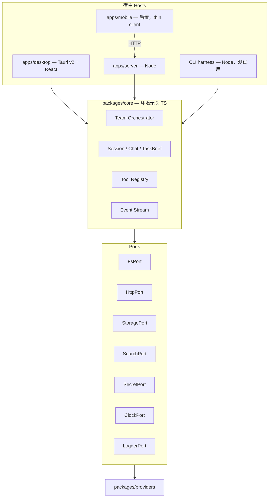

# yTriple Runtime Boundary Contract

## Status

Active。本文件取代 [V1 Technical Architecture](../technical/v1-technical-architecture.md) 的 High-Level Architecture 与 Main Layers，并解决 [V1 Agent Conversation Runtime Fix](../project/v1-agent-conversation-runtime-task.md) 第 9 条留下的问题：Rust runtime 与 TypeScript runtime 谁是真相源。

前提定位见 [Positioning](../product/positioning.md)。

## Core Proposition

**一个环境无关的 TypeScript 核心，桌面端在本地跑它，服务端在云上跑同一个它。**

旧 V1 同时存在 `src/runtime/`（TS）和 `src-tauri/src/runtime.rs`（Rust）两套编排实现，两边都声称是产品行为，于是任何行为分歧都无法判定谁对。这次的裁决是：

1. `packages/core` 是唯一真相源。业务逻辑只在这里。
2. Tauri 只做壳和能力提供者（文件系统、网络、密钥、打开文件夹），**不承载任何编排逻辑**。
3. 服务端 `apps/server` 复用同一个 `core`，不重写。

这条裁决同时是手机端和服务端将来能复用的唯一保证。

## Layering



```text
packages/
  shared/     类型、事件信封、schema（客户端与服务端共用）
  core/       团队编排、会话、TaskBrief、工具注册、子 Agent、状态机
  providers/  provider adapter + 能力描述表
apps/
  desktop/    Tauri v2 + React，本地跑 core
  server/     托管运行时 + 雷达 + AI 配置
  mobile/     占位，thin client
```

## Core Purity Rules

`packages/core` 必须满足：

- 不 import `node:*`（含 `fs` / `path` / `crypto` / `child_process`）。
- 不 import `@tauri-apps/*`。
- 不 import 任何浏览器全局（`window` / `document` / `localStorage`）。
- 不直接用 `fetch`、`process.env`、`Date.now()`、`Math.random()`、`setTimeout`。这些一律经 port 注入。
- 不做进程级副作用：不写文件、不起服务、不读环境变量。
- 不持有模块级可变单例；运行时状态挂在显式创建的 runtime 实例上。

这些规则靠 lint 规则 `no-restricted-imports` / `no-restricted-globals` 加 CI 检查执行，不靠自觉。CI 里加一条独立检查：在纯 V8 环境（无 Node 内置模块）里 import `packages/core` 必须成功。

时间与随机数经 port 注入还有一个直接收益：任务重放和快照测试可确定化。

## Ports

`core` 需要的全部外部能力收敛为 7 个 port。宿主负责实现，`core` 只见接口。

```ts
interface FsPort {                       // 只读，无写入方法
  listFiles(req: ListFilesRequest): Promise<FileEntry[]>;
  readFile(req: ReadFileRequest): Promise<FileContent>;
  searchText(req: SearchTextRequest): Promise<TextMatch[]>;
}

interface OutputPort {                   // 唯一的写入通道，与 FsPort 分离
  writeDocument(req: { taskId: string; filename: "prd.md"; content: string }): Promise<{ path: string }>;
  revealOutput(taskId: string): Promise<void>;
}

interface HttpPort {
  request(req: HttpRequest): Promise<HttpResponse>;
}

interface StoragePort {                  // 任务、团队、provider 配置、trace
  get<T>(key: string): Promise<T | null>;
  put<T>(key: string, value: T): Promise<void>;
  list(prefix: string): Promise<string[]>;
  delete(key: string): Promise<void>;
}

interface SearchPort {                   // 独立搜索，provider 无原生联网时的回退
  search(req: { query: string; maxResults: number }): Promise<SearchResult[]>;
}

interface SecretPort {                   // 只按引用取用，core 不见明文
  resolve(credentialRef: string): Promise<string>;
}

interface ClockPort { now(): number; sleep(ms: number): Promise<void>; }

interface LoggerPort { log(level: LogLevel, event: string, fields: Record<string, unknown>): void; }
```

`FsPort` 刻意只有读方法，`OutputPort` 单独承担写入。工作区只读这条产品约束因此在类型层面成立，而不是靠运行时检查。

## Host Implementations

| Port | desktop（Tauri） | server（Node） | cli harness | mobile |
| --- | --- | --- | --- | --- |
| `FsPort` | Tauri 命令，用户显式授权目录 | **不实现**，注册为 unavailable | Node fs，指定根目录 | 不实现 |
| `OutputPort` | Tauri 命令写本地输出目录 | 对象存储 + 下载端点 | Node fs | 不实现（走服务端下载） |
| `HttpPort` | Tauri HTTP（绕过 CORS，凭据不进 renderer） | Node fetch | Node fetch | 不适用 |
| `StoragePort` | Tauri store / SQLite | Postgres | 内存或临时目录 | 不适用 |
| `SearchPort` | 用户配置的搜索 API | 托管搜索 API | 可 mock | 不适用 |
| `SecretPort` | 系统 keyring | 托管 secret store（加密静态存储） | 环境变量（仅测试） | 不适用 |
| `ClockPort` / `LoggerPort` | 真实 / 前端 console + 文件 | 真实 / 结构化日志 | 可注入假时钟 | 不适用 |

手机端整列都不实现，因为它是 thin client：它通过 HTTP 消费 `apps/server`，不在设备上跑 `core`。见 [手机端就绪度检查清单](../mobile/readiness-checklist.md)。

## Hybrid Execution Modes

三种运行模式，用户可选，产品必须都支持：

| | local-only | hosted | hybrid |
| --- | --- | --- | --- |
| UI | 桌面 | 桌面 / 手机 / 浏览器 | 桌面 |
| `core` 跑在哪 | 本机 | 服务端 | 服务端 |
| 模型凭据 | 用户自己的 key（BYOK） | 托管额度或 BYOK | 托管额度或 BYOK |
| 工作区只读 | 可用 | **不可用** | **不可用** |
| 常驻雷达 | 不可用 | 可用 | 可用 |
| 长任务 / 关机后继续 | 不可用 | 可用 | 可用 |
| 手机端接入 | 不可用 | 可用 | 可用 |
| 任务数据落地 | 只在本机 | 服务端 | 服务端 |
| 是否需要账号 | 不需要 | 需要 | 需要 |

模式切换规则：

- **默认 local-only。** 不登录、不订阅也能完整跑一次 PRD 任务。这是定位的底线。
- 模式是**每次任务**的属性，不是全局开关。同一台机器上可以本地跑一个任务、托管跑另一个。
- 选了工作区的任务不能切到 hosted 或 hybrid；UI 必须在切换时明确告知会失去工作区上下文，而不是静默丢弃。
- 不做本地与服务端的自动双向同步。跨模式的数据迁移只能是用户显式的导入 / 导出动作。

## Desktop-Only Capabilities

只在桌面可用的能力，以及为什么：

1. **工作区只读（`FsPort`）。** 服务端不该拿到用户磁盘访问权，上传整个仓库也违背隐私假设。这是桌面端最核心的差异化能力。
2. **本地模型。** `localhost` 上的 Ollama 等只有本机能连。
3. **系统级操作。** 打开输出目录、系统通知、全局快捷键。
4. **系统 keyring。** 凭据留在本机，不上传。
5. **零账号使用。** 完全离线于账号体系跑任务。

### 工作区只读边界

- 只读用户显式选择的目录，路径必须校验在根目录内（含 symlink 解析后再校验）。
- 默认排除 `.git/**`、`node_modules/**`、`dist/**`、`build/**`、`.next/**`、`coverage/**`、`*.log`，以及超过大小阈值的文件。
- 不做隐式扫描，不读用户家目录，不做任何 Git 写操作。
- 写入只允许发生在输出目录，经 `OutputPort`，且不覆盖已有文件。

## Capability Negotiation

宿主在创建 runtime 时声明能力，`core` 据此过滤工具注册表并调整流程。这是「桌面独占能力」在代码里的落点。

```ts
interface RuntimeCapabilities {
  workspaceRead: boolean;
  outputWrite: boolean;
  webSearch: boolean;
  localModels: boolean;
  persistentBackgroundRuns: boolean;
  streaming: boolean;
}
```

规则：

1. 工具注册表按能力过滤。能力不具备的工具在本次任务里**根本不存在**，而不是调用后报错。
2. `core` 把协商结果写进 `TaskBrief.contextAvailability`，orchestrator 必须据此调整计划（没有工作区就不要在 brief 里安排读代码的子任务）。
3. UI 按同一份 `RuntimeCapabilities` 显示或隐藏入口，不允许出现「能点但会失败」的按钮。
4. 服务端把这份对象通过 `GET /v1/capabilities` 暴露给客户端，见 [API 契约](../server/api-contract.md)。

## Event Transport Boundary

- `core` 只**产生**事件，不知道谁在消费，也不做渲染。事件信封定义在 `packages/shared`，客户端与服务端同源。
- 传输由宿主负责：桌面走 Tauri channel / IPC，服务端走 SSE，CLI harness 直接写 stdout。
- 事件带单调递增 `seq`，消费者据此去重与补齐。持久化事件是服务端的职责，`core` 只保证顺序与完整性。
- UI 只渲染真实事件。没有事件就显示「等待中」，绝不做假进度。

## Data Residency

- local-only 的任务数据（会话、trace、输出文件）只在本机，不上传。
- hosted / hybrid 的任务数据在服务端，保留期与删除见 [托管运行时与订阅](../server/hosted-runtime-and-subscription.md)。
- 托管模式下**不上传工作区文件**。上传范围只有用户输入的文本、`TaskBrief` 和用户显式粘贴的内容。
- 雷达数据天然在服务端，因为它需要常驻采集。

## Acceptance Criteria

1. 在纯 V8 环境里 import `packages/core` 成功，CI 有对应检查。
2. 同一份任务用 CLI harness 和桌面端跑，事件序列在语义上一致。
3. 服务端不注册 `FsPort`，此时任务照样跑通，且 `TaskBrief.contextAvailability.workspace = false`。
4. `apps/desktop` 与 `apps/server` 之间没有重复的编排逻辑；编排相关代码全部在 `packages/core`。
5. `src-tauri` 里没有任何团队编排、状态机或 prompt 组装代码。
6. 注入假 `ClockPort` 后，任务事件序列可确定化重放。
7. 能力被关闭时，对应工具不出现在模型可见的工具列表里。

## Review Gate

出现以下情况应直接驳回实现：

- `packages/core` 里出现 `node:` 或 `@tauri-apps/*` import。
- Rust 侧或服务端出现第二套编排实现。
- `FsPort` 长出写入方法。
- 托管模式上传工作区文件。
- UI 显示了当前宿主不支持的能力入口。
- 事件流被 UI 直接构造，而不是来自 `core`。
