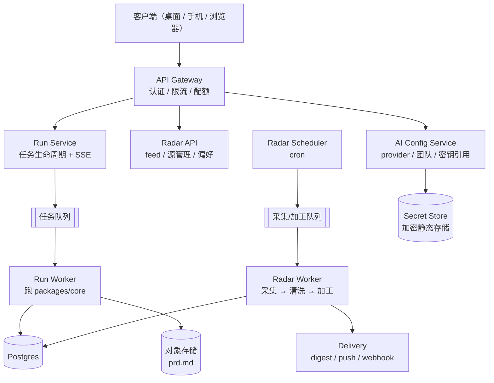

# Hosted Runtime And Subscription Design

## Status

Design only。本文件对应重建计划阶段 6，只出设计，不写代码。

前提定位见 [Positioning](../product/positioning.md)。运行模式定义见 [运行时边界契约](../contracts/runtime-boundary-contract.md) 的 Hybrid Execution Modes。

## Why Hosted Exists

桌面 local-only 模式必须完整可用，这是产品底线。托管只解决桌面解决不了的四件事：

1. **常驻采集。** 雷达需要不关机的调度器。笔记本合盖就断，这条无法用本地方案覆盖。
2. **长任务。** 派发后关机、几分钟后回来看结果。
3. **手机端接入。** 手机不跑 `core`，只能通过服务端消费（见 [手机端就绪度检查清单](../mobile/readiness-checklist.md)）。
4. **免配置起步。** 不想申请 API key 的用户也能立刻用上。

托管**不解决**的事：工作区上下文。工作区只读永远是桌面独占能力，托管模式下不上传用户文件。

## Deployment Shape



组件职责边界：

- **API Gateway**：认证、限流、配额检查、请求校验。不含业务逻辑。
- **Run Worker**：唯一跑 `packages/core` 的地方，注入服务端 port 实现。**不重写编排**。
- **Radar Scheduler / Worker**：雷达五阶段流水线，见 [雷达服务设计](radar-service-design.md)。
- **AI Config Service**：provider 配置、团队定义、凭据引用。凭据明文只在 secret store 里。

关键约束：Run Worker 与桌面端跑的是同一份 `core`，行为差异只来自注入的 port 与 `RuntimeCapabilities`。服务端出现第二套编排实现即为架构违约。

## Execution Modes In Practice

| | local-only | hosted | hybrid |
| --- | --- | --- | --- |
| UI 在哪 | 桌面 | 任意客户端 | 桌面 |
| `core` 跑在哪 | 本机 | 服务端 | 服务端 |
| 需要账号 | 否 | 是 | 是 |
| 工作区只读 | 可用 | 不可用 | 不可用 |
| 模型凭据 | 本机 keyring | 托管额度或 BYOK | 托管额度或 BYOK |
| 关机后继续 | 否 | 是 | 是 |
| 雷达 | 不可用 | 可用 | 可用 |

hybrid 的意义：用户想留在桌面界面里（习惯、快捷键、历史记录本地化），但希望这次任务跑在服务端（长任务或想省本地算力）。此时桌面只是客户端，事件通过 SSE 回来。

模式选择是**每次任务**的属性。选了工作区的任务锁定 local-only；切换模式时 UI 必须明确提示会失去工作区上下文。

## Identity And Tenancy

产品服务单人用户，身份模型刻意做薄：

- 一个账号 = 一个人。没有组织、没有成员、没有角色权限。
- 登录方式：邮箱 magic link 或 OAuth。不做密码。
- 设备：一个账号可绑多台设备，每台设备一个 device token，可单独吊销。桌面端走 device flow 换 token（见 [API 契约](api-contract.md)）。
- CLI / 自动化：长期 API token，可命名、可吊销、可限定 scope。
- 所有资源以 `userId` 为唯一归属维度；数据隔离在查询层强制，不依赖应用层判断。

不做多租户组织模型是明确取舍：一旦引入组织，权限、计费主体、共享空间会连带进来，而这些都不服务目标用户。

## Quota Model

### Credit 抽象

不按 token 直接计费，因为不同 provider 的 token 单价差两个数量级，用户无法预估。统一为 credit：

```text
credit = 归一化后的模型成本单位
1 credit ≈ 一次标准档模型的中等规模调用

计费维度：
  任务运行     按实际 token × 模型系数折算 credit
  雷达加工     Tier 1 极低、Tier 2 中、Tier 3 高
  子 Agent     计入其父 Agent 所属任务
  BYOK 调用    0 credit（用户自己的 key 自己付）
```

### Plan Tiers

| 维度 | Free | Pro |
| --- | --- | --- |
| 每月 credit | 小额，够跑通几次完整任务 | 充足额度 |
| 并发任务 | 1 | 3 |
| 子 Agent 最大深度 | 1 | 2 |
| 团队成员上限 | 3（即默认预设） | 6 |
| 雷达源数 | 少量 + 内置 curated 源 | 较多 |
| 雷达加工档位 | Tier 0/1，少量 Tier 2 | Tier 2 全量，Tier 3 按需 |
| digest | 每日 1 次 | 每日 1 次 + 即时推送 |
| BYOK | 允许 | 允许 |
| 任务数据保留 | 30 天 | 180 天 |
| 长任务后台执行 | 受限 | 支持 |

具体数字待定价决策，见开放问题。结构上要成立的几条：

- **Free 必须能跑完一次完整 PRD 任务**，否则用户无法判断产品是否有用。
- **BYOK 在所有 plan 都开放**，且不消耗 credit。目标用户大量已有 key，把 BYOK 关在付费墙后面会直接赶走他们。
- local-only 模式完全不受 plan 限制。不登录的用户不受任何额度约束。

### 超额行为

按可预测性排序，优先级从高到低：

1. **软限位提示**：额度剩余 20% 时通知。
2. **降级执行**：允许用户预设「超额后自动降到便宜模型继续」。默认关闭，因为它会静默改变输出质量。
3. **排队**：并发超限的任务排队，不拒绝。
4. **明确拒绝**：credit 耗尽时新任务返回 `quota_exceeded`，附升级或改用 BYOK 的引导。

绝不做的事：静默扣超额费用、静默降级模型、任务跑到一半因额度中断（额度检查在派发前做，派发后的任务保证跑完）。

## Run Execution

### 生命周期

```text
POST /v1/runs            -> 创建 run，状态 queued，做额度与能力预检
入队                     -> Run Worker 领取，状态转 chatting
用户消息 / orchestrator 提问 -> 走 messages 端点，事件经 SSE 回客户端
派发                     -> 状态 running，成员并行执行
合并与写出               -> prd.md 落对象存储
completed | failed       -> 事件流终止，run 转终态
```

### 可靠性要求

- **幂等创建**：`POST /v1/runs` 接 `Idempotency-Key`，网络重试不产生重复任务。
- **worker 崩溃恢复**：任务状态与事件持久化在 Postgres，worker 重启后从最后一个已提交事件继续；不可恢复则任务转 `failed` 并说明阶段。
- **事件持久化 + 重连**：事件带单调 `seq`，客户端断线后用 `Last-Event-ID` 补齐。事件保留至任务数据保留期结束。
- **超时**：单次模型调用、单个成员执行、整个任务各有独立超时。任务级超时转 `failed`，已完成成员的贡献保留在 trace 里。
- **取消**：`POST /v1/runs/{id}/cancel` 立即停止派发新工作，已在飞行的模型调用尽力中止，已消耗的 credit 不退。
- **并发去重**：同一 run 不允许两个 worker 同时持有，用租约机制。

## Data And Privacy

托管模式的数据边界必须写死，因为这是隐私敏感用户决定是否登录的依据：

**会上传到服务端：**

- 用户在聊天里输入的文本。
- `TaskBrief` 与运行事件。
- 用户显式粘贴的内容。
- 生成的 `prd.md`。
- 雷达源配置、画像与反馈。

**不会上传：**

- 工作区文件内容与目录结构。托管模式下 `FsPort` 根本不注册，工作区工具不存在。
- 本地 keyring 里的凭据（除用户显式选择 BYOK 上传的那份）。
- local-only 任务的任何数据。

**其他承诺：**

- 用户数据不用于模型训练。转发给上游 provider 的内容受该 provider 的条款约束，配置界面必须显示当前 provider 的数据条款链接。
- 完整导出：任务、`prd.md`、雷达画像可一键导出为归档文件。
- 删除账号即删除全部私有数据，含 secret store 里的凭据。共享的雷达 story 与共享加工缓存不含个人数据，不受影响。

### BYOK In Hosted Mode

- 用户可以把自己的 key 交给服务端，存 secret store（信封加密，静态加密，按 `userId` 隔离）。
- BYOK 调用不计 credit，但仍受并发与速率限制。
- 凭据只在 Run Worker 内解密使用，不进日志、不进事件、不回给客户端（只回是否已配置与后四位）。
- 用户可随时吊销；吊销后正在跑的任务失败并说明原因。

## Observability And SLO

- 结构化日志：`userId`、`runId`、`agentId`、`providerId`、`degradations`。**凭据与用户输入正文不进日志。**
- 关键指标：任务成功率、端到端时长分位、每任务 credit 消耗分布、provider 错误率、降级发生率、雷达源健康率、加工缓存命中率。
- 告警：provider 错误率突增、队列积压、雷达大面积源失效、单用户异常 credit 消耗。
- 初期 SLO 目标（单人产品，不承诺企业级）：API 可用性、feed 可用性优先于任务执行可用性——任务失败用户可以重试，feed 挂了用户没东西看。

## Open Questions

1. 定价与免费额度的具体数字。
2. 订阅是单一 Pro 档，还是「工作台」与「雷达」分开订阅。雷达的常驻成本结构与任务型成本结构差异很大。
3. 是否提供自托管形态（目标用户里有相当比例愿意自己部署）。
4. 本地与服务端的数据同步边界：当前决定是不做自动同步，只做显式导入导出，这条需要在真实使用后复核。
5. IM 推送渠道选型。
6. Tier 3 深度加工是否单独计价。

## Design Exit Criteria

1. 三种执行模式的能力矩阵与 `RuntimeCapabilities` 字段一一对应。
2. credit 折算公式能对每个已支持模型给出系数。
3. 每条 plan 限制都能映射到 API 层的一个可执行检查点。
4. 事件持久化与 `Last-Event-ID` 重连方案与 [API 契约](api-contract.md) 一致。
5. 数据上传清单能逐条对应到具体端点与字段。
6. Run Worker 不含任何编排逻辑，只做 port 注入与生命周期管理。
