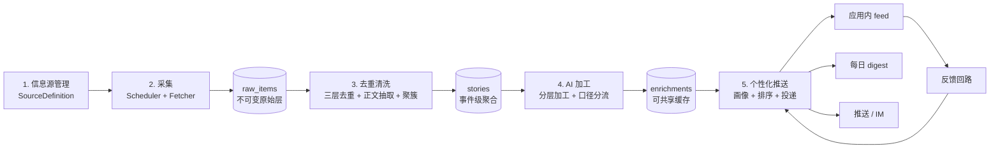

# Radar Service Design

## Status

Design only。本文件对应重建计划阶段 6，只出设计，不写代码。代码等桌面端 PRD 工作台稳定后再动。

前提定位见 [Positioning](../product/positioning.md)。运行边界见 [运行时边界契约](../contracts/runtime-boundary-contract.md)。对外接口见 [API 契约](api-contract.md)。

## What Radar Is

雷达是 yTriple 的第二条产品链路：**把用户关心的信息源持续变成少量、加工过、值得看的条目。**

它不是 RSS 阅读器。RSS 阅读器给你 200 条标题，雷达给你 8 条带判断的条目，并告诉你每条为什么重要。

两类目标用户的诉求不同，同一条链路末端分流：

- **个人开发者**：技术栈动态、依赖破坏性变更、竞品发版、值得抄的实现。关心「这对我在做的东西有什么影响」。
- **个人自媒体工作者**：行业事件、热点窗口、可讲的故事、数据素材。关心「这能不能写、从什么角度写」。

雷达必须跑在服务端：常驻采集需要不关机的调度器，个人开发者的笔记本不满足这个条件。这也是托管订阅存在的主要理由之一。

## Pipeline Overview



五个阶段之间用队列解耦，每个阶段可独立重跑。原始层不可变是重跑的前提：清洗规则或加工 prompt 改了，可以对历史数据重放，不需要重新抓。

## Stage 1: Source Management

### 数据模型

```ts
type SourceType =
  | "rss"              // RSS / Atom
  | "json_api"         // 有结构化 API 的站点
  | "html_page"        // 需要抽取的普通网页列表
  | "keyword_watch"    // 关键词监听，底层走 SearchPort
  | "release_feed";    // GitHub releases / changelog 这类版本源

interface SourceDefinition {
  sourceId: string;
  type: SourceType;
  url: string;
  displayName: string;
  topics: string[];              // 归类标签，供订阅与排序使用
  audience: Array<"developer" | "creator">;  // 影响默认加工口径
  fetchIntervalMinutes: number;  // 基线频率，调度器可自适应调整
  authRef?: string;              // 需要凭据时指向 secret store
  extraction?: ExtractionRule;   // html_page 专用
  health: SourceHealth;
  shared: boolean;               // true 表示平台内置源，加工结果可跨用户共享
}

interface SourceHealth {
  lastSuccessAt?: number;
  lastErrorAt?: number;
  consecutiveFailures: number;
  state: "healthy" | "degraded" | "suspended";
  avgItemsPerDay: number;
}
```

### 规则

- 平台维护一批 curated 内置源（`shared: true`），新用户开箱就有内容，不需要先配 20 个 RSS。这是「默认路径零配置」原则在雷达上的落点。
- 用户可以加自己的源（`shared: false`），也可以按 topic 订阅内置源。
- 连续失败达到阈值后 `state` 转 `degraded`，再失败转 `suspended` 并通知源的拥有者。suspended 源不再占用调度资源。
- 每个 plan 有源数量上限，见 [托管运行时与订阅](hosted-runtime-and-subscription.md)。
- 采集只走公开可访问内容，遵守 `robots.txt` 与站点 ToS；不做登录墙绕过，不做付费墙绕过。

## Stage 2: Collection

### 调度

- 每个源按 `fetchIntervalMinutes` 排程，加随机 jitter 打散，避免整点惊群。
- **自适应频率**：连续多次抓到 0 条新内容则退避（上限 24 小时），高产源则收紧（下限 15 分钟）。低价值源不该消耗和高价值源一样的配额。
- 单源单实例互斥，防止重复抓取。
- 全局并发上限与按域名并发上限（同域名默认 ≤ 2），做礼貌抓取。

### 增量

每个源维护游标，避免全量重抓：

- `rss` / `release_feed`：`ETag` + `If-Modified-Since` + 已见条目 `guid` 集合。
- `json_api`：上游 cursor 或 `since` 时间戳。
- `html_page`：列表页首屏条目的 URL 集合。
- `keyword_watch`：上次查询时间窗。

### 原始层

```ts
interface RawItem {
  rawItemId: string;
  sourceId: string;
  fetchedAt: number;
  url: string;
  canonicalUrl?: string;      // 清洗阶段回填
  title: string;
  publishedAt?: number;
  rawBody: string;            // 原始 HTML 或正文
  contentHash: string;
  httpMeta: { status: number; etag?: string };
}
```

原始层只追加，不修改，不删除（除保留期到期的批量清理）。

### 失败处理

- 网络 / 5xx / 超时：指数退避重试，最多 3 次，仍失败则记入 `SourceHealth` 并等下一个周期。
- 4xx：不重试，直接记失败；连续 404 判定源失效。
- 解析失败：保留原始响应供人工排查，条目丢弃但不算源失败。
- 采集失败**永不影响** feed 可用性，用户看到的是上一批内容加一条源健康提示。

## Stage 3: Deduplication And Cleaning

雷达价值的一半在这个阶段。同一件事会从 6 个源以 6 个标题进来，如果不合并，用户看到的还是信息过载。

### 三层去重

```text
第 1 层  URL 规范化
         去 utm_* / fbclid 等跟踪参数、统一协议与末尾斜杠、解析已知短链、
         去 AMP 与 m. 变体 -> canonicalUrl 完全相同则直接判重

第 2 层  内容指纹
         正文抽取后归一化（去空白、去样板文字）-> contentHash 相同判重
         抓住转载与镜像站

第 3 层  语义近似
         标题 + 正文首段做 embedding（或 SimHash 作为廉价档）
         余弦相似度超阈值且发布时间在同一时间窗内 -> 归入同一 story
         抓住「同一件事的不同报道」
```

第 1、2 层是确定性的，直接丢弃重复项。第 3 层是概率性的，**不丢弃条目，而是聚簇**：多个来源共同指向同一事件本身就是重要性信号，应该保留并用于排序。

### 清洗

- 正文抽取（可读性算法），去导航、广告、订阅弹窗、页脚。
- 语言检测，非用户语言的条目按偏好过滤或标记待翻译。
- 垃圾过滤：纯营销稿、内容农场、标题党（正文与标题严重不符）、过短条目。
- 实体抽取：产品名、公司、技术栈、人物，供后续排序与检索使用。

### Story 模型

```ts
interface Story {
  storyId: string;
  canonicalTitle: string;      // 取聚簇内最优标题
  primaryUrl: string;
  memberItems: string[];       // rawItemId 列表，多源即多来源支撑
  sourceCount: number;         // 排序信号：几个独立源报了这件事
  firstSeenAt: number;
  lastUpdatedAt: number;
  entities: string[];
  topics: string[];
  language: string;
  cleanBody: string;
}
```

## Stage 4: AI Enrichment

### 分层加工

全量条目都用贵模型加工是成本自杀。按三档分流，每一档只处理上一档筛出来的：

```text
Tier 0  规则前置（零模型成本）
        源权重、时效窗、实体命中用户关注列表、sourceCount
        -> 淘汰明显无关的大头

Tier 1  廉价分类打分（cheap 档模型，批量，一次多条）
        输出：topics、audience 适配度、importance 0-100、是否重复主题
        -> 只有 importance 超阈值的进入 Tier 2

Tier 2  标准加工（standard 档模型，单条）
        输出：summary、why_it_matters、按口径的角度建议、实体消歧

Tier 3  深度加工（premium 档，仅极少数高分 story 或用户显式请求）
        起一个小型 Agent 团队（复用 packages/core），做背景补齐与交叉验证
        -> 这是雷达与 PRD 工作台共用 core 的地方
```

Tier 3 之所以复用 `packages/core` 的团队编排而不是另写一套：深度加工本质上就是「一个 orchestrator 带一两个成员做调研与审查」，正是 [Agent 团队契约](../contracts/agent-team-contract.md) 已经定义的流程。雷达只需要提供另一个团队预设，而不是另一套运行时。

### 加工产物

```ts
interface Enrichment {
  storyId: string;
  audience: "developer" | "creator" | "shared";
  tier: 0 | 1 | 2 | 3;
  modelRef: string;                  // 可追溯哪个模型产出
  summary: string;                   // 3 句以内
  whyItMatters: string;              // 一句话判断，这是雷达的核心增值
  importance: number;                // 0-100
  confidence: "low" | "medium" | "high";
  topics: string[];
  developerView?: {                  // 口径分流
    impact: string;                  // 对在做的东西有什么影响
    actionability: "watch" | "try" | "migrate" | "ignore";
    migrationCost?: string;
    relatedStack: string[];
  };
  creatorView?: {
    angles: string[];                // 2-3 个可写的切入角度
    audienceHook: string;
    heatWindow: "now" | "days" | "weeks" | "evergreen";
    contentFormat: string[];         // 短文 / 视频 / newsletter
  };
  factsVsInference: { facts: string[]; inferences: string[] };
}
```

`whyItMatters` 和 `factsVsInference` 是硬性字段。前者是用户唯一真正需要的东西；后者防止加工把推测讲成事实——这在给自媒体用户当素材时尤其危险。

### 口径分流

- 一条 story 可以同时有 `developerView` 和 `creatorView`，也可以只有其中一个。
- 分流依据：source 的 `audience`、story 的 topics、以及订阅该 story 的用户构成。只有开发者订阅的源不必生成 `creatorView`。
- Tier 1 与 Tier 2 的 `audience: "shared"` 部分（summary、topics、importance 基线）在用户间**共享缓存**：同一条 story 只加工一次，所有订阅者复用。这是雷达成本模型成立的关键。
- 个性化只发生在阶段 5（排序与投递），不在阶段 4 重复烧模型。

### 成本控制

- 每用户每日加工预算上限，超出后只跑 Tier 0/1，feed 仍可用但少了 `whyItMatters`（明确标注，不静默）。
- 加工结果按 `(storyId, audience, promptVersion)` 缓存；prompt 版本变化才重算。
- Tier 3 需要用户显式触发或极高 importance，且计入 credit。
- 批量调用优先：Tier 1 一次请求处理多条。

## Stage 5: Personalized Delivery

### 兴趣画像

```ts
interface InterestProfile {
  userId: string;
  audience: "developer" | "creator" | "both";
  explicitTopics: string[];        // 用户勾选
  watchedEntities: string[];       // 关注的技术栈、产品、公司
  mutedTopics: string[];
  mutedSources: string[];
  implicitSignals: {               // 从行为累积，衰减
    topicAffinity: Record<string, number>;
    entityAffinity: Record<string, number>;
  };
  deliveryPreferences: DeliveryPreferences;
}
```

显式偏好优先于隐式信号。隐式信号带时间衰减，避免半年前的一次点击长期污染排序。

### 排序

```text
score = w1 * 相关性(画像 × topics/entities)
      + w2 * 新鲜度(按 heatWindow 调整的时间衰减)
      + w3 * 权威度(源权重 × sourceCount)
      + w4 * importance(加工得分)
      - w5 * 相似惩罚(与本批已选条目的语义距离过近)
      - w6 * 疲劳惩罚(该 topic 近期已推过多)
```

`w5`、`w6` 是刻意的反回音室项。单人用户的信息面本来就窄，如果排序只顺着历史偏好收敛，雷达就退化成回音室，对自媒体选题尤其致命。每批投递强制保留 1-2 个探索位。

### 投递形态

| 渠道 | 形态 | 适用 | 备注 |
| --- | --- | --- | --- |
| 应用内 feed | 分页流，按 score 排序 | 桌面 + 手机 | 主形态，随时拉取 |
| 每日 digest | 固定时间的 8-12 条摘要 | 邮件 / 应用内 | 低打扰，适合自媒体每日选题 |
| 即时推送 | 高分条目单条推送 | 手机推送 / IM webhook | 有静默窗与频率上限 |
| IM 集成 | webhook 推到用户自己的 Bot | 可选 | 渠道形态仍是开放问题 |

投递规则：

- 即时推送有硬频率上限（默认每日 ≤ 3 条）和静默窗（默认 22:00-08:00 本地时间）。宁可漏推，不可打扰。
- digest 的生成时间按用户时区。
- 同一 story 在同一渠道只投一次，除非有实质更新（`lastUpdatedAt` 变化且新增独立来源）。

### 反馈回路

- 显式反馈：有用 / 无关 / 屏蔽这个源 / 屏蔽这个话题。
- 隐式反馈：展开、点开原文、保存、跳过（曝光未互动）。
- 反馈写回 `implicitSignals`，并作为源权重的调整输入：某个源持续被判无关就自动降权。
- 「转成 PRD 任务」和「转成选题」是最强的正向信号，权重最高。

## Integration With The PRD Workshop

雷达不是孤岛。两条链路的连接点：

- feed 里任一 story 可**一键作为任务输入**：story 的 `summary` + `whyItMatters` + 来源链接直接进新任务的初始消息，orchestrator 从这里开始 intake。
- 对开发者：`developerView.impact` 适合直接起一个「要不要跟进这个变更」的小任务。
- 对自媒体：`creatorView.angles` 适合直接起一个内容方案任务（PRD 之外的第二个模板候选，模板选谁仍是开放问题）。
- 反向连接：用户正在做的项目（来自历史任务的 topics 与 entities）自动补充 `watchedEntities`，让雷达知道该盯什么。这是雷达比通用信息流更准的根本原因。

## Failure And Degradation

| 故障 | 行为 |
| --- | --- |
| 单源采集失败 | feed 正常，显示源健康提示 |
| 去重服务（embedding）不可用 | 降到 SimHash 廉价档，标注聚簇质量下降 |
| 加工模型不可用 | 只出 Tier 0/1，feed 条目无 `whyItMatters` 并明确标注 |
| 用户加工预算耗尽 | 同上，附额度提示 |
| 推送渠道失败 | 重试后转应用内 feed，不丢条目 |
| 排序服务异常 | 退化为按时间倒序，明确标注 |

原则和 PRD 工作台一致：降级必须可见，绝不静默。

## Data Retention

- `raw_items`：默认 30 天，之后只留 metadata 与 `contentHash`。
- `stories` 与 `enrichments`：默认 180 天。
- 用户反馈与画像：账号存续期间保留，用户可清空。
- 用户删除账号时删除其私有源、画像与反馈；共享源的 story 与共享加工结果不受影响。

## Open Questions

延续重建计划里的开放问题，这几条在写代码前要定：

1. 推送渠道优先级：应用内、邮件、IM 三者先做哪个。
2. 内置 curated 源清单由谁维护、怎么保证质量。
3. 语义去重的相似度阈值需要真实数据调参，先跑一批离线评测。
4. 开发者与自媒体两个口径是否值得完全分成两套 prompt，还是共享主体 + 差异化尾段。
5. Tier 2 的加工是否允许用户自带 key（BYOK）以绕开额度限制。
6. 「转成内容方案」需要 PRD 之外的第二个模板，模板选型待定。

## Design Exit Criteria

这份设计可以进入实现的前提：

1. 五个阶段的数据模型都能落成具体表结构，且原始层可重放。
2. 加工成本模型算得出来：给定 N 个源、M 个用户，每日 credit 消耗有可估上界。
3. 去重三层的判定顺序与阈值有离线评测方案。
4. 加工产物 schema 与 [API 契约](api-contract.md) 的 feed 响应形状一致。
5. Tier 3 的团队预设能表达为一份合法 `TeamDefinition`。
6. 每一条降级路径在 API 层都有可表达的标注字段。
